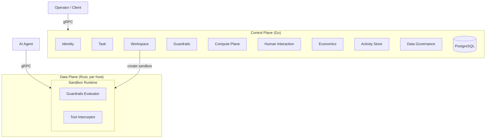
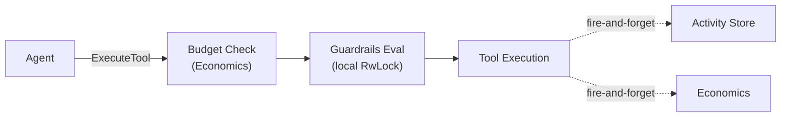
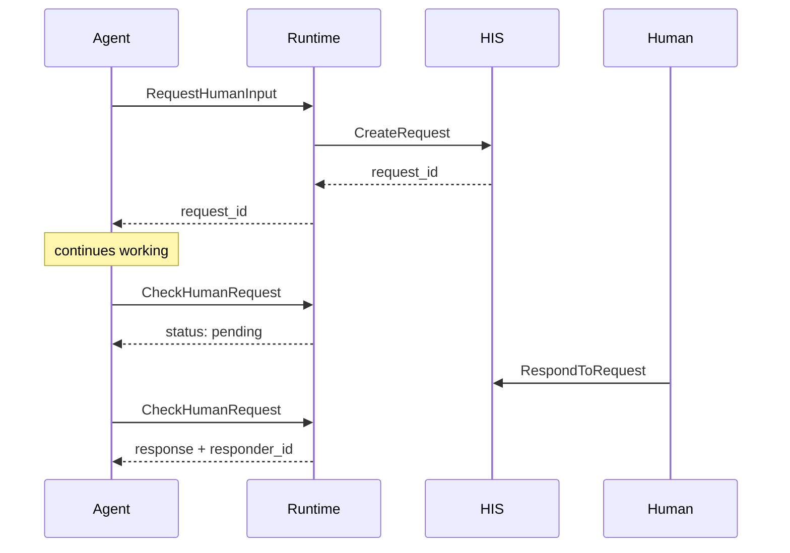
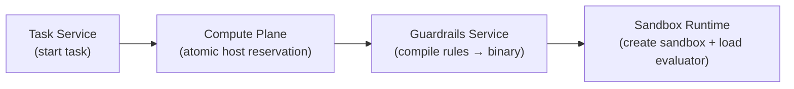

# Bulkhead

Bulkhead is an enterprise platform for deploying autonomous AI agents safely. It provides sandboxed execution environments with real-time guardrails evaluation, human-in-the-loop escalation, budget enforcement, and a complete audit trail — giving organizations the control they need to run AI agents in production.

## Key Features

- **Sandboxed Execution** — Each agent runs in an isolated workspace with resource limits, allowed tool lists, and environment variable injection
- **Real-Time Guardrails** — Every tool call is evaluated against compiled policy rules in <50ms. Rules can deny, allow, escalate, or log actions based on tool names, parameters, and agent identity
- **Human-in-the-Loop** — Agents can request human input (approvals, questions, escalations) via a non-blocking poll pattern. Supports configurable delivery channels and timeout policies
- **Budget Enforcement** — Per-agent budgets checked before every tool execution. Usage metered automatically with cost reporting
- **Append-Only Audit Trail** — Every action (allowed, denied, escalated) is recorded immutably with full context, latency metrics, and guardrail rule attribution
- **Credential Brokering** — Scoped, time-limited credentials (max 24h TTL) with SHA-256 token hashing. Agents can be suspended or deactivated instantly
- **Compute Placement** — Best-fit host selection with atomic resource reservation (no TOCTOU races). Host heartbeat monitoring for fleet health
- **Data Governance** — Content classification (Public/Internal/Confidential/Restricted) with DLP pattern detection for PII, credentials, and sensitive data

## Architecture Overview



The control plane handles setup and orchestration; the data plane handles agent execution. See [Core Flows](#core-flows) below for how data moves between components.

### Services

| Service | Language | Description |
|---------|----------|-------------|
| **Identity** | Go | Agent registry, scoped credential brokering, trust level management |
| **Workspace** | Go | Orchestrates workspace lifecycle — placement, guardrails compilation, sandbox provisioning |
| **Task** | Go | Task lifecycle management, triggers workspace provisioning on task start |
| **Compute Plane** | Go | Host fleet management, best-fit workspace placement with atomic reservation |
| **Guardrails** | Go | Rule CRUD, policy compilation to binary format consumed by the Rust evaluator |
| **Human Interaction** | Go | Approval/question/escalation requests with delivery channels and timeout policies |
| **Activity Store** | Go | Append-only action records with streaming support |
| **Economics** | Go | Usage metering, per-agent budgets, cost reporting |
| **Data Governance** | Go | Content classification, DLP pattern detection, egress policy enforcement |
| **Sandbox Runtime** | Rust | Per-host binary running sandboxed agent workloads with <50ms guardrails evaluation |

### Core Flows

**1. Action Evaluation (Hot Path, <50ms)** — Every tool call an agent makes flows through the Runtime: budget check via Economics, guardrails evaluation (local, RwLock read), tool execution, then fire-and-forget recording to Activity Store and Economics.



**2. Human Interaction (Non-Blocking)** — Agent submits a request through the Runtime, which forwards it to the Human Interaction Service. The agent gets back a `request_id` and polls until a human responds.



**3. Workspace Orchestration** — When a task starts, the Workspace Service coordinates placement, policy compilation, and sandbox creation across three services.



## Quick Start

### Prerequisites

- Go 1.24+
- Rust 1.83+
- Docker and Docker Compose
- [buf](https://buf.build/) CLI (for proto generation)
- [grpcurl](https://github.com/fullstorydev/grpcurl) (for examples below)

### Build and Test

```bash
# Build everything
make build

# Run all unit tests
make test

# Run integration tests (requires Docker)
make test-integration
```

### Run with Docker Compose (Full Stack)

```bash
# Start all 11 services (9 Go + 1 Rust + PostgreSQL)
docker compose -f deploy/docker-compose.yml up --build

# Verify services are healthy
docker compose -f deploy/docker-compose.yml ps
```

### Run Locally (Development)

```bash
# Start PostgreSQL only
docker compose -f deploy/docker-compose.yml up -d postgres

# Build and run individual services
cd control-plane && go run ./cmd/identity
```

## Usage Examples

All examples use `grpcurl` against the Docker Compose port mappings.

### 1. Register an Agent and Mint Credentials

```bash
# Register a new agent
grpcurl -plaintext -d '{
  "name": "invoice-processor",
  "description": "Processes incoming invoices and routes for approval",
  "owner_id": "org-acme",
  "purpose": "Automate accounts payable workflow",
  "trust_level": "AGENT_TRUST_LEVEL_NEW",
  "capabilities": ["read_file", "write_file", "http_request"]
}' localhost:50060 platform.identity.v1.IdentityService/RegisterAgent

# Mint a scoped credential (1 hour TTL)
grpcurl -plaintext -d '{
  "agent_id": "<agent_id from above>",
  "scopes": ["workspace:create", "tool:execute"],
  "ttl_seconds": 3600
}' localhost:50060 platform.identity.v1.IdentityService/MintCredential
# Response includes a one-time "token" field — save it for authenticated calls
```

### 2. Create Guardrail Rules and Compile a Policy

```bash
# Create a rule that denies shell execution
grpcurl -plaintext -d '{
  "name": "deny-shell",
  "description": "Block shell and exec tools",
  "type": "RULE_TYPE_TOOL_FILTER",
  "condition": "exec,shell,sudo",
  "action": "RULE_ACTION_DENY",
  "priority": 1,
  "enabled": true
}' localhost:50062 platform.guardrails.v1.GuardrailsService/CreateRule

# Create a rule that escalates file deletions to humans
grpcurl -plaintext -d '{
  "name": "escalate-delete",
  "description": "Require human approval for file deletion",
  "type": "RULE_TYPE_TOOL_FILTER",
  "condition": "delete_file,rm",
  "action": "RULE_ACTION_ESCALATE",
  "priority": 5,
  "enabled": true
}' localhost:50062 platform.guardrails.v1.GuardrailsService/CreateRule

# Compile both rules into a binary policy
grpcurl -plaintext -d '{
  "rule_ids": ["<rule_id_1>", "<rule_id_2>"]
}' localhost:50062 platform.guardrails.v1.GuardrailsService/CompilePolicy
# Returns compiled_policy (bytes) and rules_count

# Dry-run the policy against a sample tool call
grpcurl -plaintext -d '{
  "rule_ids": ["<rule_id_1>", "<rule_id_2>"],
  "tool_name": "exec",
  "parameters": {},
  "agent_id": "agent-001"
}' localhost:50062 platform.guardrails.v1.GuardrailsService/SimulatePolicy
# Returns verdict: DENY, matched_rule: "deny-shell"
```

### 3. Set a Budget and Check It

```bash
# Set a $100 budget for the agent
grpcurl -plaintext -d '{
  "agent_id": "<agent_id>",
  "limit": 100.00,
  "currency": "USD"
}' localhost:50066 platform.economics.v1.EconomicsService/SetBudget

# Check if the agent can proceed
grpcurl -plaintext -d '{
  "agent_id": "<agent_id>",
  "estimated_cost": 0.50
}' localhost:50066 platform.economics.v1.EconomicsService/CheckBudget
# Returns: allowed: true, remaining: 100.00
```

### 4. Create a Task (Full Orchestration)

When the full stack is running, creating a task triggers the complete orchestration flow:

```bash
grpcurl -plaintext -d '{
  "agent_id": "<agent_id>",
  "goal": "Process all pending invoices for Q4",
  "workspace_config": {
    "memory_mb": 1024,
    "cpu_millicores": 500,
    "disk_mb": 2048,
    "max_duration_secs": 3600,
    "allowed_tools": ["read_file", "write_file", "http_request"]
  },
  "guardrail_policy_id": "<rule_id_1>,<rule_id_2>",
  "budget_config": {
    "max_cost": 50.00,
    "currency": "USD",
    "on_exceeded": "BUDGET_ON_EXCEEDED_HALT"
  }
}' localhost:50068 platform.task.v1.TaskService/CreateTask

# Transition task to running (triggers workspace provisioning)
grpcurl -plaintext -d '{
  "task_id": "<task_id>",
  "status": "TASK_STATUS_RUNNING"
}' localhost:50068 platform.task.v1.TaskService/UpdateTaskStatus
```

This triggers: Compute placement -> Guardrails compilation -> Runtime sandbox creation.

### 5. Execute a Tool (Agent Hot Path)

Inside a running sandbox, the agent calls the Agent API with its sandbox ID in metadata:

```bash
# Execute a tool (agent-facing API on the runtime)
grpcurl -plaintext \
  -H "x-sandbox-id: <sandbox_id>" \
  -d '{
    "tool_name": "read_file",
    "parameters": {"path": "/data/invoices/inv-001.json"},
    "justification": "Reading invoice for processing"
  }' localhost:50052 platform.runtime.v1.AgentAPIService/ExecuteTool
# Returns: verdict (ALLOW/DENY/ESCALATE), result, denial_reason
```

### 6. Human-in-the-Loop Escalation

```bash
# Agent requests human input (non-blocking)
grpcurl -plaintext \
  -H "x-sandbox-id: <sandbox_id>" \
  -d '{
    "question": "Invoice #INV-2024-789 is for $50,000. Approve payment?",
    "options": ["approve", "reject", "flag for review"],
    "context": "Vendor: Acme Corp, Amount: $50,000, Due: 2024-03-15",
    "timeout_seconds": 300
  }' localhost:50052 platform.runtime.v1.AgentAPIService/RequestHumanInput
# Returns: request_id (agent can continue working)

# Agent polls for response
grpcurl -plaintext -d '{
  "request_id": "<request_id>"
}' localhost:50052 platform.runtime.v1.AgentAPIService/CheckHumanRequest
# Returns: status (pending/responded/expired), response, responder_id

# Human responds (via operator API)
grpcurl -plaintext -d '{
  "request_id": "<request_id>",
  "response": "approve",
  "responder_id": "user-jane"
}' localhost:50063 platform.human.v1.HumanInteractionService/RespondToRequest
```

## Project Structure

```
bulkhead/
├── proto/                          # Protocol Buffer definitions
│   └── platform/
│       ├── identity/v1/            #   Agent registry, credentials
│       ├── workspace/v1/           #   Workspace lifecycle
│       ├── runtime/v1/             #   RuntimeService + AgentAPIService
│       ├── compute/v1/             #   Host fleet, placement
│       ├── guardrails/v1/          #   Rule CRUD, policy compilation
│       ├── human/v1/               #   Human interaction requests
│       ├── activity/v1/            #   Action records
│       ├── economics/v1/           #   Usage metering, budgets
│       ├── governance/v1/          #   Data classification, DLP
│       └── task/v1/                #   Task lifecycle
│
├── control-plane/                  # Go microservices
│   ├── cmd/                        #   Service entry points (9 binaries)
│   │   ├── identity/
│   │   ├── workspace/
│   │   ├── compute/
│   │   ├── guardrails/
│   │   ├── human/
│   │   ├── activity/
│   │   ├── economics/
│   │   ├── governance/
│   │   └── task/
│   ├── internal/                   #   Business logic per service
│   │   ├── config/                 #     Shared configuration
│   │   ├── database/               #     PostgreSQL connection + migrations
│   │   ├── middleware/             #     Auth + logging interceptors
│   │   ├── models/                 #     Domain types
│   │   └── <service>/             #     repository.go, service.go, handler.go
│   ├── migrations/                 #   SQL schema migrations (6 files)
│   └── pkg/gen/                    #   Generated protobuf Go code
│
├── runtime/                        # Rust data-plane
│   └── crates/
│       ├── runtime/                #   Main binary (sandbox-runtime)
│       │   └── src/
│       │       ├── main.rs         #     Entry point, service wiring
│       │       ├── server.rs       #     RuntimeService (control API)
│       │       ├── agent_api.rs    #     AgentAPIService (agent-facing)
│       │       ├── sandbox/        #     SandboxManager, SandboxState
│       │       └── tools/          #     ToolInterceptor
│       ├── guardrails-eval/        #   Policy evaluator library
│       └── proto-gen/              #   Generated protobuf Rust code
│
├── deploy/
│   ├── docker-compose.yml          # Full stack (11 services)
│   └── docker/
│       ├── Dockerfile.control-plane
│       └── Dockerfile.runtime
│
├── Makefile                        # Build, test, lint, dev targets
└── LICENSE                         # Apache 2.0
```

## Development

### Make Targets

| Target | Description |
|--------|-------------|
| `make build` | Build Go control-plane and Rust runtime |
| `make test` | Run all unit tests (Go + Rust) |
| `make test-integration` | Run integration tests (requires Docker for PostgreSQL via TestContainers) |
| `make test-integration-identity` | Run integration tests for a specific service |
| `make proto` | Regenerate protobuf code (Go via buf, Rust via build.rs) |
| `make dev` | Start Docker Compose (full stack) |
| `make dev-down` | Stop Docker Compose |
| `make fmt` | Format Go + Rust code |
| `make lint` | Lint protos (buf), Go (vet), Rust (clippy) |
| `make clean` | Clean build artifacts |

### Testing

```bash
# Unit tests (fast, no external dependencies)
make test

# Integration tests (PostgreSQL via TestContainers)
make test-integration

# Single service integration test
make test-integration-identity
make test-integration-workspace
```

### Proto Generation

```bash
# Go (uses buf CLI with buf.gen.yaml config)
make proto

# Rust (automatic via build.rs — regenerates on cargo build)
cd runtime && cargo build
```

## Further Documentation

- [Architecture Deep Dive](docs/architecture.md) — Design principles, service details, core flow diagrams
- [API Reference](docs/api-reference.md) — Complete RPC reference for all 10 services
- [Deployment Guide](docs/deployment.md) — Docker Compose, configuration, database schema

## License

Apache 2.0 — see [LICENSE](LICENSE) for details.
