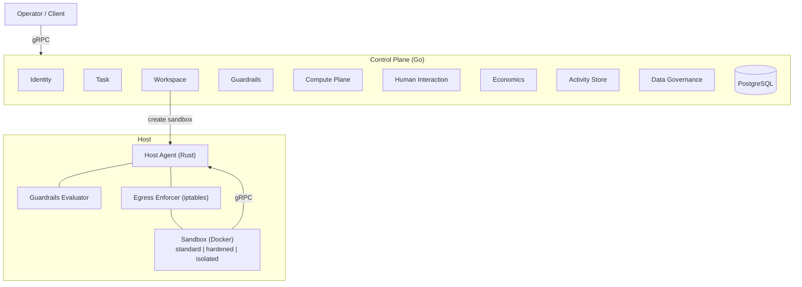

# Bulkhead

Bulkhead is an enterprise platform for deploying autonomous AI agents safely. It provides sandboxed execution environments with real-time guardrails evaluation, human-in-the-loop escalation, budget enforcement, and a complete audit trail — giving organizations the control they need to run AI agents in production.

## Architecture



The **control plane** (Go) handles orchestration, persistence, and policy management. The **Host Agent** (Rust) runs on each host and manages sandboxed containers with configurable isolation tiers (standard, hardened, isolated) — it evaluates guardrails and budget as a policy engine while agents execute tools inside their containers.

## Key Features

- **Sandboxed Execution** — Each agent runs in an isolated Docker container with configurable isolation tiers (standard, hardened with seccomp + read-only rootfs, or isolated with gVisor/Kata runtime), resource limits, allowed tool lists, and environment variable injection
- **Egress Allowlist** — Per-sandbox network egress control via iptables. Approved destinations pass; all other outbound traffic is dropped at the kernel level
- **Policy-Only Host Agent** — Evaluates guardrails and budget, returns a verdict (ALLOW/DENY/ESCALATE). Agents execute tools locally inside their container
- **Real-Time Guardrails** — Every tool call evaluated in <50ms against compiled policy rules
- **Human-in-the-Loop** — Non-blocking approval/question/escalation requests with configurable delivery channels and timeout policies
- **Budget Enforcement** — Per-agent budgets checked before every tool execution
- **Append-Only Audit Trail** — Every action recorded immutably with full context and latency metrics
- **Python SDK** — `@tool` decorator handles the evaluate-execute-report cycle transparently. Integrates with LangChain
- **Credential Brokering** — Scoped, time-limited credentials with SHA-256 token hashing
- **Compute Placement** — Best-fit host selection with atomic resource reservation and isolation-tier-aware filtering
- **Isolation Tier Auto-Selection** — Automatic selection of sandbox isolation tier (standard/hardened/isolated) based on agent trust level and data classification

## Choose Your Guide

| I want to... | Guide |
|--------------|-------|
| Deploy the platform, configure guardrails, create tasks via gRPC | [Operator Guide](docs/getting-started/operator-guide.md) |
| Build an agent with the Python SDK (`@tool` decorator) | [Agent Developer Guide](docs/getting-started/agent-guide.md) |
| Integrate Bulkhead guardrails into a LangChain agent | [LangChain Integration Guide](docs/getting-started/langchain-guide.md) |

## Quick Start

```bash
# Build everything
make build

# Run all unit tests
make test

# Start the full stack (9 Go + 1 Rust + PostgreSQL)
docker compose -f deploy/docker-compose.yml up --build

# Verify services are healthy
docker compose -f deploy/docker-compose.yml ps
```

## Project Structure

```
bulkhead/
├── proto/                          # Protocol Buffer definitions
│   └── platform/
│       ├── identity/v1/            #   Agent registry, credentials
│       ├── workspace/v1/           #   Workspace lifecycle
│       ├── host_agent/v1/           #   Host Agent gRPC services
│       ├── compute/v1/             #   Host fleet, placement
│       ├── guardrails/v1/          #   Rule CRUD, policy compilation
│       ├── human/v1/               #   Human interaction requests
│       ├── activity/v1/            #   Action records
│       ├── economics/v1/           #   Usage metering, budgets
│       ├── governance/v1/          #   Data classification, DLP
│       └── task/v1/                #   Task lifecycle
│
├── control-plane/                  # Go microservices (9 services)
│   ├── cmd/                        #   Service entry points
│   ├── internal/                   #   Business logic per service
│   └── migrations/                 #   SQL schema migrations
│
├── runtime/                        # Host Agent (Rust)
│   └── crates/
│       ├── runtime/                #   Main binary
│       │   └── src/
│       │       ├── main.rs         #     Entry point, service wiring
│       │       ├── server.rs       #     HostAgentService (control API)
│       │       ├── agent_api.rs    #     HostAgentAPIService (policy-only)
│       │       ├── container.rs    #     Docker + iptables egress
│       │       └── sandbox/        #     SandboxManager, SandboxState
│       ├── guardrails-eval/        #   Policy evaluator library
│       └── proto-gen/              #   Generated protobuf Rust code
│
├── sdk/                            # Language SDKs
│   └── python/                     #   Python SDK (bulkhead-sdk)
│       ├── bulkhead/               #     Client, @tool decorator, types
│       └── examples/               #     Basic agent, LangChain integration
│
├── deploy/
│   ├── docker-compose.yml          # Full stack (11 containers)
│   └── docker/
│       ├── Dockerfile.control-plane
│       └── Dockerfile.host-agent
│
├── docs/
│   ├── getting-started/
│   │   ├── operator-guide.md       # Deploy and operate the platform
│   │   ├── agent-guide.md          # Build agents with the Python SDK
│   │   └── langchain-guide.md      # LangChain integration
│   ├── architecture.md             # Design principles and core flows
│   ├── api-reference.md            # Complete RPC reference
│   └── deployment.md               # Docker Compose, config, database
│
├── Makefile                        # Build, test, lint, dev targets
└── LICENSE                         # Apache 2.0
```

## Development

| Target | Description |
|--------|-------------|
| `make build` | Build Go control-plane and Rust Host Agent |
| `make test` | Run all unit tests (Go + Rust) |
| `make test-integration` | Run integration tests (requires Docker) |
| `make proto` | Regenerate protobuf code |
| `make dev` / `make dev-down` | Start / stop Docker Compose |
| `make fmt` | Format Go + Rust code |
| `make lint` | Lint protos, Go, Rust |

## Reference Documentation

- [Architecture](docs/architecture.md) — Design principles, service details, core flow diagrams
- [API Reference](docs/api-reference.md) — Complete RPC reference for all 10 services
- [Deployment Guide](docs/deployment.md) — Docker Compose topology, configuration, database schema

## License

Apache 2.0 — see [LICENSE](LICENSE) for details.
