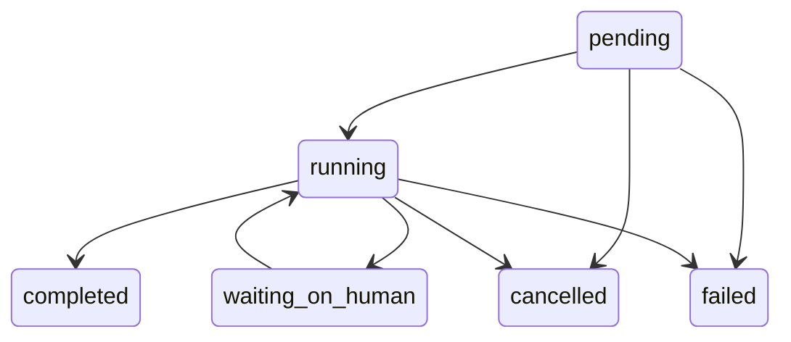
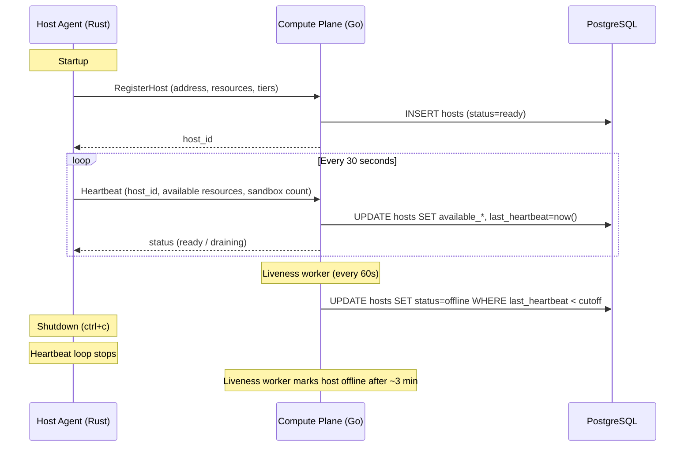
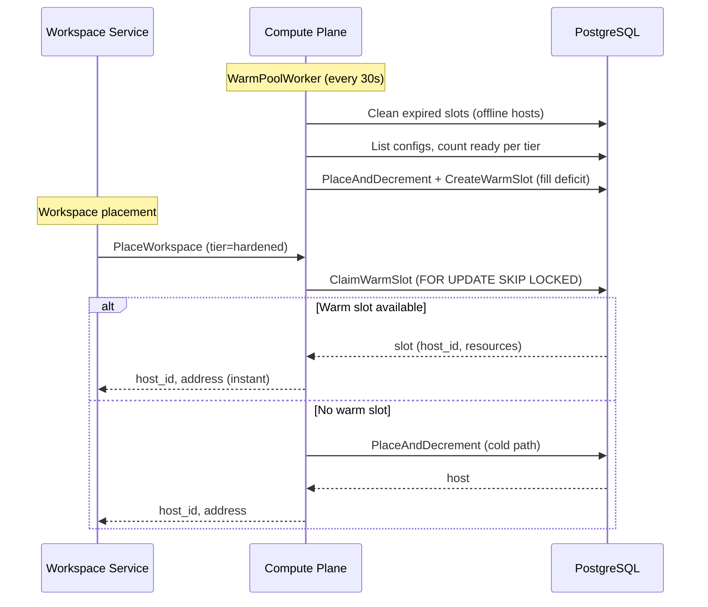
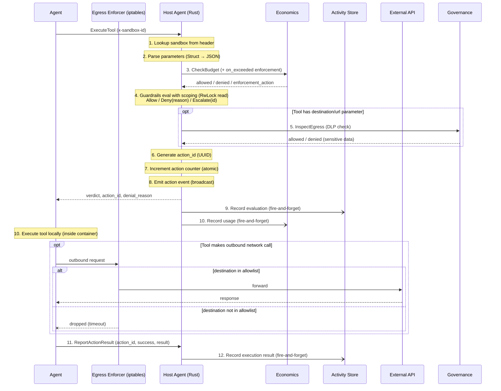
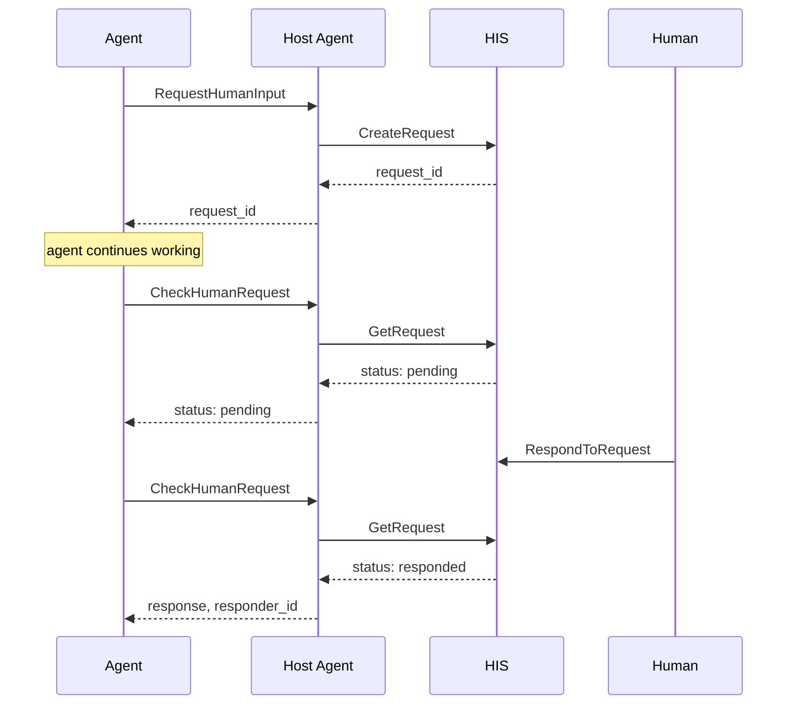
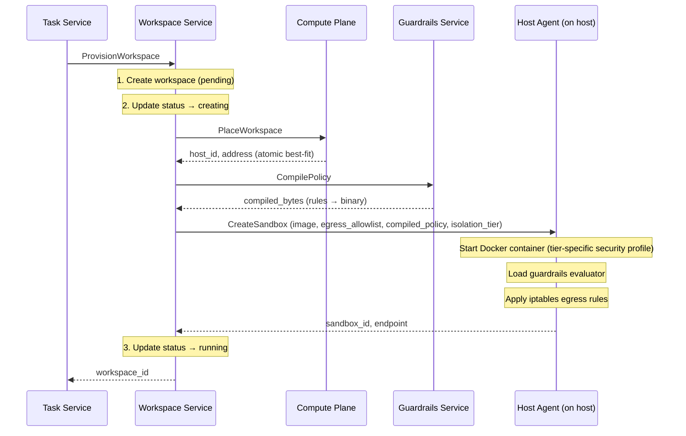
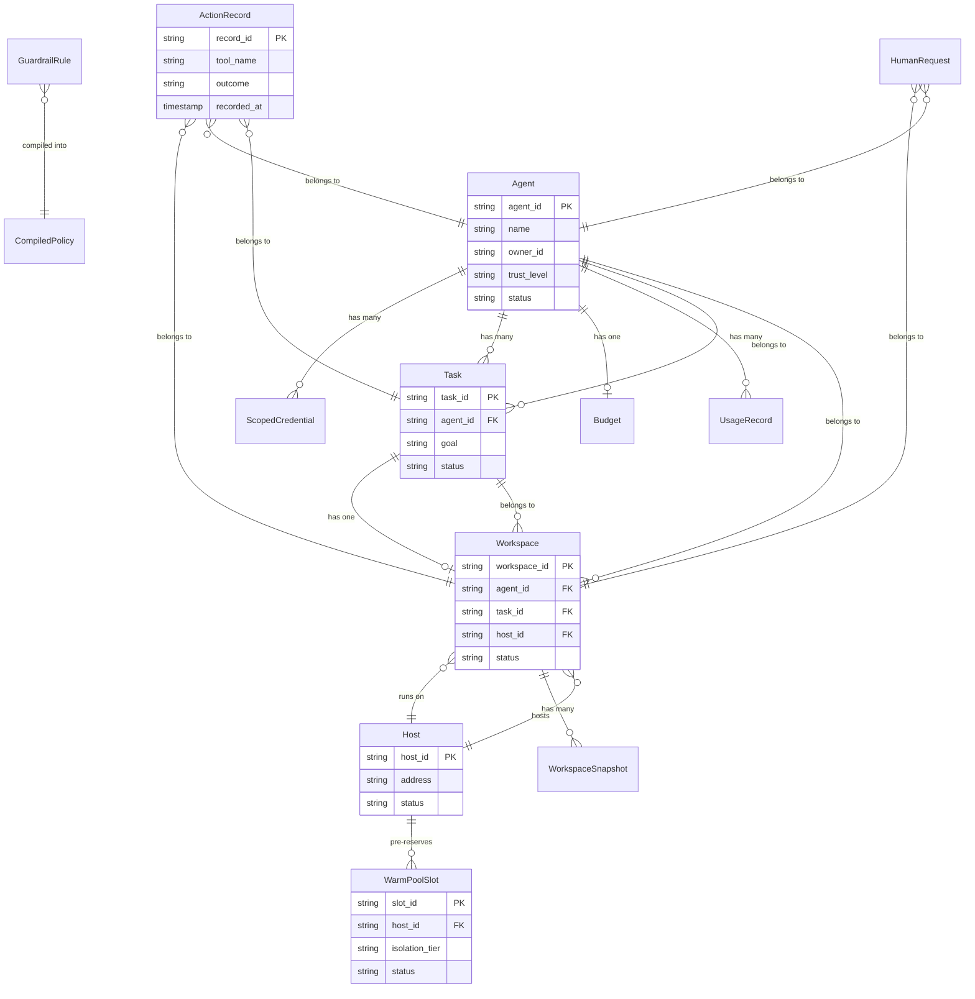

# Architecture

> **Getting started?** See the [Operator Guide](getting-started/operator-guide.md), [Agent Developer Guide](getting-started/agent-guide.md), or [LangChain Integration Guide](getting-started/langchain-guide.md).

Bulkhead follows a control-plane / host-agent architecture. The **control plane** (Go) manages the lifecycle of agents, workspaces, tasks, guardrails, and budgets. The **Host Agent** (Rust) runs on each host and manages sandboxed containers with configurable isolation tiers (standard, hardened, isolated) and real-time guardrails evaluation.

## Design Principles

1. **Control-plane / host-agent separation** — The control plane handles orchestration, persistence, and policy management. The Host Agent handles hot-path evaluation with minimal latency. They communicate over gRPC.

2. **Guardrails in the hot path** — Every tool call is evaluated against compiled policy rules before execution. The Rust evaluator targets <50ms latency with lock-free concurrent reads via `RwLock`.

3. **Human-in-the-loop as a first-class citizen** — Agents can pause for human input at any point. The interaction is non-blocking (submit + poll pattern), so agents can continue other work while waiting.

4. **Append-only audit trail** — Every action (allowed, denied, or escalated) is recorded immutably in the Activity Store with full context: tool name, parameters, verdict, guardrail rule ID, and latency metrics.

5. **Budget enforcement at runtime** — Per-agent budgets are checked before every tool execution. Usage is metered asynchronously after each successful call. Budget exhaustion triggers immediate denial.

6. **Atomic resource management** — Compute placement uses `SELECT ... FOR UPDATE SKIP LOCKED` to atomically reserve resources, preventing double-allocation under concurrent requests.

7. **Graceful degradation** — Optional upstream services (HIS, Activity Store, Economics) degrade gracefully when not configured. The Host Agent warns and continues rather than failing.

8. **Multi-tenancy at the data layer** — Every tenant-scoped table includes a `tenant_id` column, and all queries filter by it. Cross-tenant data access is structurally impossible, not just policy-enforced.

---

## Multi-Tenancy

Bulkhead is multi-tenant by default. Every API request is scoped to a tenant, and all data access is isolated at the database layer.

**How it works:**

1. **Credential binding** — When a credential is minted (`MintCredential`), it is associated with a `tenant_id`. The auth middleware extracts this from the credential on every request and injects it into the request context.

2. **Automatic scoping** — Handlers read `tenant_id` from the context and pass it through the service layer to the repository. Every database query filters by `(id, tenant_id)` — a tenant cannot read, modify, or even detect another tenant's resources.

3. **Implicit creation** — There is no `CreateTenant` API. A tenant comes into existence when its first agent is registered via `RegisterAgent` with a `tenant_id` field. All subsequent resources (workspaces, tasks, credentials, guardrails) inherit the tenant scope from the authenticated credential.

4. **Shared infrastructure** — The `hosts` table has no `tenant_id` — compute hosts are shared infrastructure. Placement, heartbeats, and capacity are global. Tenant isolation happens at the workspace and sandbox level, not the host level.

**Tenant-scoped tables (13):** agents, scoped_credentials, tasks, workspaces, workspace_snapshots, guardrail_rules, guardrail_sets, human_requests, delivery_channels, timeout_policies, action_records, budgets, usage_records.

**Request flow:**

```
gRPC Request
  → Auth Middleware (extract tenant_id from credential)
    → Handler (read tenant_id from context)
      → Service (pass tenant_id as parameter)
        → Repository (WHERE id = $1 AND tenant_id = $2)
```

---

## Observability

All services export distributed traces via OpenTelemetry, providing end-to-end visibility across the control plane and Host Agent.

**Tracing architecture:**

- All 9 Go services initialize an OTLP trace exporter on startup via `telemetry.InitTracer("bulkhead-{service}", endpoint)`
- The Host Agent (Rust) also exports traces via the same OTLP endpoint
- If `OTEL_EXPORTER_OTLP_ENDPOINT` is empty, tracing is disabled (no-op provider) — zero overhead
- gRPC calls are automatically instrumented via the `otelgrpc.NewServerHandler()` stats handler
- A span enrichment interceptor (`UnarySpanEnrichInterceptor`) adds `bulkhead.tenant_id` and `bulkhead.agent_id` attributes to every span, enabling filtering by tenant or agent in the trace UI

**Docker Compose setup:**

The default stack includes Jaeger all-in-one as the trace backend:

| Component | Port | Purpose |
|-----------|------|---------|
| Jaeger UI | 16686 | Trace visualization and search |
| Jaeger OTLP receiver | 4317 | Accepts OTLP gRPC spans from all services |

All services are pre-configured to export to `jaeger:4317`. Access the Jaeger UI at `http://localhost:16686` to search traces by service, operation, tenant, or agent.

**Service names:**

| Service | Trace Name |
|---------|-----------|
| Identity | `bulkhead-identity` |
| Workspace | `bulkhead-workspace` |
| Task | `bulkhead-task` |
| Compute | `bulkhead-compute` |
| Guardrails | `bulkhead-guardrails` |
| Human Interaction | `bulkhead-human` |
| Activity Store | `bulkhead-activity` |
| Economics | `bulkhead-economics` |
| Data Governance | `bulkhead-governance` |
| Host Agent | `bulkhead-host-agent` |

---

## Service Descriptions

### Identity Service

The agent registry and credential authority. Every AI agent in the platform is registered here with a name, owner, trust level (new/established/trusted), and capability list. The service issues scoped, time-limited credentials (max 24h TTL) using 256-bit cryptographically random tokens stored as SHA-256 hashes. Agents can be suspended (temporary) or deactivated (permanent, revokes all credentials atomically).

**Responsibilities:**
- Agent registration with labels, purpose, and capabilities
- Scoped credential minting and revocation
- Trust level management with justification tracking
- Agent suspension and reactivation with status transition validation

### Workspace Service

The orchestrator for sandboxed execution environments. When a workspace is created, the service coordinates with three other services: Compute Plane (to find a host with sufficient resources), Guardrails (to compile a policy from rule IDs), and the Runtime (to create a sandbox on the selected host). The workspace tracks its full lifecycle from pending through running to terminated.

**Responsibilities:**
- Workspace creation with resource specs (memory, CPU, disk, duration)
- Orchestrated provisioning: placement → policy compilation → credential minting → sandbox creation
- Automatic credential injection (`BULKHEAD_AGENT_TOKEN`, `BULKHEAD_AGENT_ID`) into sandbox environment
- Workspace termination with sandbox teardown
- Snapshot and restore for pause/resume workflows (local filesystem or S3 backend)

### Task Service

The top-level entry point for agent work. A task represents a goal assigned to an agent, with associated workspace configuration, guardrail policies, human interaction settings, and budget limits. When a task transitions to "running", the service automatically provisions a workspace through the Workspace Service.

**Responsibilities:**
- Task creation with full configuration (workspace, guardrails, budget, HIS)
- Status transitions with validation (pending → running → completed/failed/cancelled)
- Automatic workspace provisioning on task start
- Automatic workspace termination on task completion/cancellation

**Valid Status Transitions:**


### Compute Plane Service

Manages the fleet of runtime hosts and handles workspace placement. Hosts register with their total resource capacity, supported isolation tiers, and report availability via heartbeats. Placement uses a best-fit algorithm — selecting the smallest host that can satisfy the request and supports the requested isolation tier — with atomic resource reservation to prevent race conditions.

**Responsibilities:**
- Host registration and deregistration with supported isolation tiers
- Heartbeat processing (resource updates, active sandbox counts, tier updates)
- Best-fit workspace placement with `FOR UPDATE SKIP LOCKED` and tier filtering
- Host status management (ready/draining/offline)

#### Host Discovery & Lifecycle

Hosts self-register with the Compute Plane on startup and maintain liveness through periodic heartbeats:



**Host Status Transitions:**

| From | To | Trigger |
|------|----|---------|
| (none) | `ready` | `RegisterHost` RPC |
| `ready` | `draining` | Operator calls `DeregisterHost` or sets status via API |
| `ready` | `offline` | Liveness worker detects missed heartbeats (default: 3 min timeout) |
| `draining` | `offline` | Operator finalizes decommission |

Only `ready` hosts are eligible for workspace placement. Draining hosts reject new placements but continue running existing sandboxes. Offline hosts are excluded from all operations.

**Configuration:**

| Env Var (Host Agent) | Default | Purpose |
|---------------------|---------|---------|
| `COMPUTE_ENDPOINT` | (none) | Compute Plane gRPC endpoint. Enables registration + heartbeats. |
| `TOTAL_MEMORY_MB` | 16384 | Memory capacity advertised to Compute Plane |
| `TOTAL_CPU_MILLICORES` | 8000 | CPU capacity advertised to Compute Plane |
| `TOTAL_DISK_MB` | 102400 | Disk capacity advertised to Compute Plane |

| Env Var (Compute Plane) | Default | Purpose |
|------------------------|---------|---------|
| `HEARTBEAT_TIMEOUT_SECS` | 180 | Seconds without a heartbeat before marking host offline |

#### Placement Algorithm

When a workspace needs a host, `PlaceWorkspace` runs a single atomic SQL query that selects, reserves, and returns the best candidate:

```sql
UPDATE hosts SET
  available_memory_mb = available_memory_mb - $requested,
  active_sandboxes = active_sandboxes + 1
WHERE id = (
  SELECT id FROM hosts
  WHERE status = 'ready'
    AND available_memory_mb >= $requested_memory
    AND available_cpu_millicores >= $requested_cpu
    AND available_disk_mb >= $requested_disk
    AND ($tier = '' OR supported_tiers @> ARRAY[$tier]::text[])
  ORDER BY array_length(supported_tiers, 1) ASC,
           available_memory_mb ASC
  LIMIT 1
  FOR UPDATE SKIP LOCKED
)
RETURNING ...
```

**Key properties:**

1. **Atomic reservation** — `FOR UPDATE SKIP LOCKED` acquires a row lock on the selected host, preventing concurrent requests from double-booking the same resources. `SKIP LOCKED` means if one request is in-flight, the next request skips to the next-best host instead of blocking.

2. **Tier filtering** — `supported_tiers @> ARRAY[$tier]` uses PostgreSQL array containment to match only hosts that support the requested isolation tier. An empty tier matches all hosts.

3. **Tier-aware best-fit** — Hosts are sorted first by `array_length(supported_tiers)` ascending (fewest capabilities first), then by `available_memory_mb` ascending (least available memory first). This preserves specialized hosts (e.g., gVisor-capable) for workloads that actually need them, while directing standard workloads to simpler hosts.

4. **Resource correction via heartbeats** — Heartbeats continuously update the host's available resources from the host's perspective, correcting any drift between the control plane's bookkeeping and actual resource consumption.

#### Warm Pool

The warm pool pre-reserves sandbox slots on hosts so that `PlaceWorkspace` can claim a pre-warmed slot instantly, eliminating cold-start latency. Operators configure a target count of ready slots per isolation tier via `ConfigureWarmPool`.

**How it works:**

1. **Configuration** — `ConfigureWarmPool` upserts a `WarmPoolConfig` specifying the isolation tier, target slot count, and default resource allocation (memory, CPU, disk).

2. **Replenishment** — A background `WarmPoolWorker` runs every 30 seconds. Each sweep:
   - Cleans expired slots (slots on hosts that have gone offline)
   - Counts ready slots per tier
   - If ready < target, allocates new slots via `PlaceAndDecrement` (same atomic reservation as cold placement)

3. **Claiming** — When `PlaceWorkspace` receives a request with an isolation tier, it first tries `ClaimWarmSlot` — an atomic `UPDATE ... FOR UPDATE SKIP LOCKED` that claims a ready slot. If no warm slot is available, it falls back to cold placement.

4. **Capacity reporting** — `GetCapacity` aggregates per-tier capacity from hosts, warm pool configs, and warm pool slots into a fleet-wide summary.



**Key properties:**

1. **Zero-overhead claiming** — `ClaimWarmSlot` uses `FOR UPDATE SKIP LOCKED`, the same concurrency pattern as cold placement. Concurrent claims never block each other.

2. **Self-healing** — The replenisher automatically cleans slots on offline hosts and refills below-target tiers. No operator intervention needed after initial configuration.

3. **Graceful fallback** — If the warm pool is empty, placement silently falls back to cold allocation. The warm pool is purely an optimization, not a requirement.

### Guardrails Service

Manages guardrail rules and compiles them into binary policies consumed by the Rust evaluator. Rules define conditions (tool name patterns, parameter checks) and actions (allow, deny, escalate, log) with priority ordering. The `CompilePolicy` RPC produces a JSON-serialized `CompiledPolicy` that the runtime deserializes into its evaluator. `SimulatePolicy` provides dry-run testing.

**Responsibilities:**
- CRUD operations for guardrail rules with optional scoping
- Policy compilation (rule IDs → binary bytes)
- Policy simulation (dry-run against sample tool calls)
- Considered evaluation tier — periodic behavior analysis via `GetBehaviorReport`

**Rule Scoping:**

Rules can be scoped to restrict when they apply. An empty scope means the rule applies globally (all agents, all tools). Scopes support four dimensions:
- `agent_ids` — only evaluate for specific agents
- `tool_names` — only evaluate for specific tools
- `trust_levels` — only evaluate for agents at specific trust levels (new/established/trusted)
- `data_classifications` — only evaluate for data at specific classification levels (public/internal/confidential/restricted)

Scopes are compiled into the binary policy and evaluated in the Rust hot path. If a rule's scope doesn't match the current context, the rule is skipped entirely.

**Considered Evaluation Tier:**

In addition to real-time per-call evaluation, the Guardrails Service runs a "considered" evaluation tier that analyzes agent behavior over time windows. The `ConsideredEvaluator` periodically queries the Activity Store and computes:
- Denial rate (high = agent may be probing boundaries)
- Error rate (high = agent may be stuck or misconfigured)
- Action velocity (high = potential runaway loop)
- Stuck agent detection (consecutive errors on the same tool)

Results are exposed via `GetBehaviorReport` for operators and can trigger alerts.

**Rule Types:**
| Type | Condition Format | Example |
|------|-----------------|---------|
| `ToolFilter` | Comma-separated tool names | `exec,shell,sudo` |
| `ParameterCheck` | `field=value` | `path=/etc/shadow` |
| `RateLimit` | Reserved for future use | — |
| `BudgetLimit` | Reserved for future use | — |

### Human Interaction Service (HIS)

Delivers agent requests to humans and collects responses. Supports three request types: approvals, questions, and escalations, each with urgency levels (low/normal/high/critical). Includes configurable delivery channels and timeout policies that define what happens when a request expires (escalate, continue, or halt).

**Responsibilities:**
- Create/get/respond to human requests
- Delivery channel configuration per user (generic webhook-based)
- Timeout policy management (global, per-agent, per-workspace)
- Background timeout enforcement worker (30s polling interval)
- Webhook delivery — when a request is created, enabled channels receive a standard JSON payload via HTTP POST

**Webhook Delivery:**

All delivery channels use a standard `WebhookPayload` JSON format. The platform sends HTTP POST requests with `Content-Type: application/json`, `X-Bulkhead-Channel-Type`, and `X-Bulkhead-Request-ID` headers. Community adapters can bridge webhooks to Slack, email, Teams, PagerDuty, etc.

### Activity Store

An append-only record of every action executed in the platform. Each record captures the full context: workspace, agent, tool name, parameters, result, verdict, guardrail rule ID, denial reason, and latency metrics. Supports both query-based retrieval and real-time streaming via server-sent events.

**Responsibilities:**
- Append-only action recording (no updates or deletes)
- Query with filters (workspace, agent, task, tool, outcome, time range)
- Real-time action streaming with workspace/agent filtering
- Alert configuration and evaluation (denial rate, error rate, action velocity, budget breach, stuck agent)
- Background alert engine that periodically evaluates conditions and sends webhook notifications

### Economics Service

Handles usage metering and budget enforcement. Every tool execution is recorded as a usage event with resource type, quantity, and cost. Per-agent budgets define spending limits over 30-day periods. The `CheckBudget` RPC is called in the runtime hot path before every tool execution.

**Responsibilities:**
- Usage recording (resource type, quantity, cost)
- Budget management (set/get per agent, 30-day periods)
- Budget checking (allowed/denied with remaining balance and enforcement action)
- Cost reporting (aggregated by resource type)
- `on_exceeded` enforcement: `halt` (deny all), `request_increase` (trigger HIS request), `warn` (allow but log warning)
- `warning_threshold` (0.0–1.0): returns a warning flag when remaining balance drops below threshold

### Data Governance Service

A stateless service for content classification and data loss prevention. Classifies content into four levels (Public, Internal, Confidential, Restricted) by detecting patterns like SSNs, credit card numbers, AWS keys, emails, and phone numbers. The `InspectEgress` RPC combines classification with policy checking in a single call for the hot path.

**Responsibilities:**
- Content classification with pattern detection
- Egress policy enforcement (restrict sensitive data to approved destinations)
- Combined classify+check for hot-path use

**Classification Levels:**
| Level | Triggers | Example Patterns |
|-------|----------|-----------------|
| Public | Default (no sensitive patterns) | — |
| Internal | Email, phone patterns | `user@example.com` |
| Confidential | Cloud credentials | `AKIA...` (AWS keys) |
| Restricted | PII patterns | SSN (`123-45-6789`), credit card numbers |

### Host Agent

A Rust binary that runs on each host in the fleet, **outside** the agent containers. It exposes two gRPC services: **HostAgentService** (called by the control plane to manage sandboxes) and **HostAgentAPIService** (called by agents running inside containers for guardrail evaluation). The Host Agent is a **policy-only engine** — it evaluates guardrails and budget but does NOT execute tools. Agents run inside Docker containers with configurable isolation tiers, execute tools locally, and call back to the Host Agent via `ReportActionResult` to record outcomes for the audit trail.

The Host Agent manages the full lifecycle of agent containers (create, resource-limit, destroy) via the bollard crate (enabled via `ENABLE_DOCKER=true`). Each sandbox tracks its own guardrails evaluator, container ID, isolation tier, and allowed tool list. The evaluator uses `RwLock` for concurrent read access with support for hot-reload via `UpdateSandboxGuardrails`.

**Isolation Tiers:**

| Tier | Security Profile | Use Case |
|------|-----------------|----------|
| **standard** | Normal Docker (cgroups + namespaces) | Trusted agents, internal data |
| **hardened** | Seccomp + read-only rootfs + no-new-privileges + dropped capabilities | New/untrusted agents, confidential data |
| **isolated** | gVisor/Kata runtime + all hardened options | High-risk agents, restricted data |

Tier auto-selection is based on agent trust level and data classification. Operators can override with an explicit tier in the workspace spec. Hosts declare their supported tiers (via `SUPPORTED_TIERS` env var), and compute placement filters by tier compatibility.

**Responsibilities:**
- Sandbox lifecycle management (create, destroy, status, events)
- Docker container lifecycle (start, stop, resource limits)
- Per-sandbox egress allowlist enforcement via iptables (FORWARD chain rules)
- Guardrails evaluation in the hot path (RwLock for concurrent reads, <50ms)
- Hot-reload of guardrails policies without sandbox restart
- Policy-only `ExecuteTool` — returns verdict + action_id, no tool execution
- DLP egress inspection — for allowed tool calls with destination/url parameters, calls the Governance Service's `InspectEgress` RPC to block sensitive data exfiltration
- `ReportActionResult` — records agent-reported tool outcomes for audit trail
- Budget checking with `on_exceeded` enforcement (halt, request_increase, warn) before tool evaluation
- Activity recording (optional, via Activity Store)
- Human interaction forwarding (optional, via HIS)

**Layered Security Model:**

| Layer | Enforces | Mechanism |
|-------|----------|-----------|
| Guardrails | Intent (what agent requests) | Policy eval in Rust (<50ms) |
| Egress allowlist | Network behavior (actual traffic) | iptables FORWARD rules per container |
| Container isolation | Process boundary | Tiered: standard (cgroups), hardened (seccomp + caps), isolated (gVisor/Kata) |
| Image allowlist | Deployment policy | Organizational image registry |

---

## Core Flows

### Flow 1: Action Evaluation (Policy-Only Hot Path)

This is the most performance-critical flow — executed on every tool call an agent makes. Target latency: <50ms for guardrails evaluation. The Host Agent is **policy-only**: it evaluates but does not execute tools.



Steps 9, 10, and 13 are fire-and-forget (`tokio::spawn`) — they don't block the response to the agent. The DLP check (step 5) only runs for tool calls with destination/url/endpoint parameters — it inspects outbound content for sensitive data patterns before the agent executes. The Python SDK's `@tool` decorator handles steps 11–13 transparently (see [Agent Developer Guide](getting-started/agent-guide.md)). The egress enforcer operates at the kernel level (iptables FORWARD chain) — it filters actual network traffic independently of guardrails evaluation.

### Flow 2: Human Interaction (Non-Blocking)

Agents can request human input without blocking. The pattern is: submit a request, get back a `request_id`, then poll for the response.



### Flow 3: Workspace Orchestration

When a task starts, the Workspace Service coordinates three services to provision a sandboxed environment:



If any step fails, the workspace is marked as `failed` rather than throwing — the caller can inspect the workspace status to understand what went wrong. The `CreateSandbox` step sets up all three security layers: the guardrails evaluator (intent filtering), the egress enforcer (network filtering via iptables FORWARD chain rules), and container isolation with the requested tier (standard: namespaces + cgroups, hardened: seccomp + read-only rootfs + dropped caps, isolated: gVisor/Kata runtime).

---

## Data Model



---

## Technology Stack

| Component | Technology | Purpose |
|-----------|-----------|---------|
| Control Plane | Go 1.24 | 9 microservices with gRPC APIs |
| Host Agent | Rust 1.83 | Per-host policy engine, <50ms evaluation, Docker container lifecycle, iptables egress |
| Python SDK | Python 3.10+ | `@tool` decorator, evaluate → execute → report cycle |
| Container Runtime | bollard (Rust) / Docker | Agent container lifecycle with isolation tiers (opt-in via `ENABLE_DOCKER`) |
| Database | PostgreSQL 16 | Shared persistence for all control-plane services |
| RPC Framework | gRPC / Protocol Buffers | Inter-service communication |
| Build (Go) | `go build`, buf (proto) | Standard Go toolchain |
| Build (Rust) | Cargo, tonic-build | Async Rust with Tokio |
| Deployment | Docker Compose | 11-container local stack |
| Auth | SHA-256 token hashing | Scoped credentials via gRPC metadata |
| Logging | zap (Go), tracing (Rust) | Structured logging |
| Testing | `go test`, `cargo test`, TestContainers | Unit + integration |
