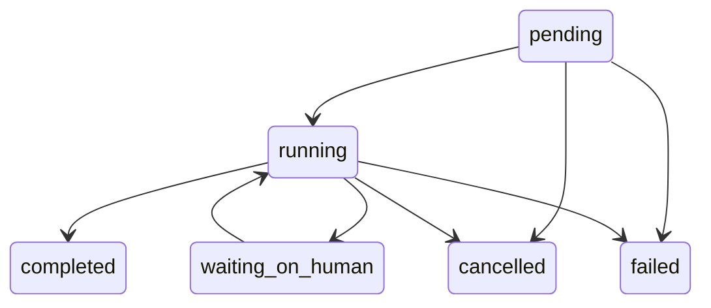
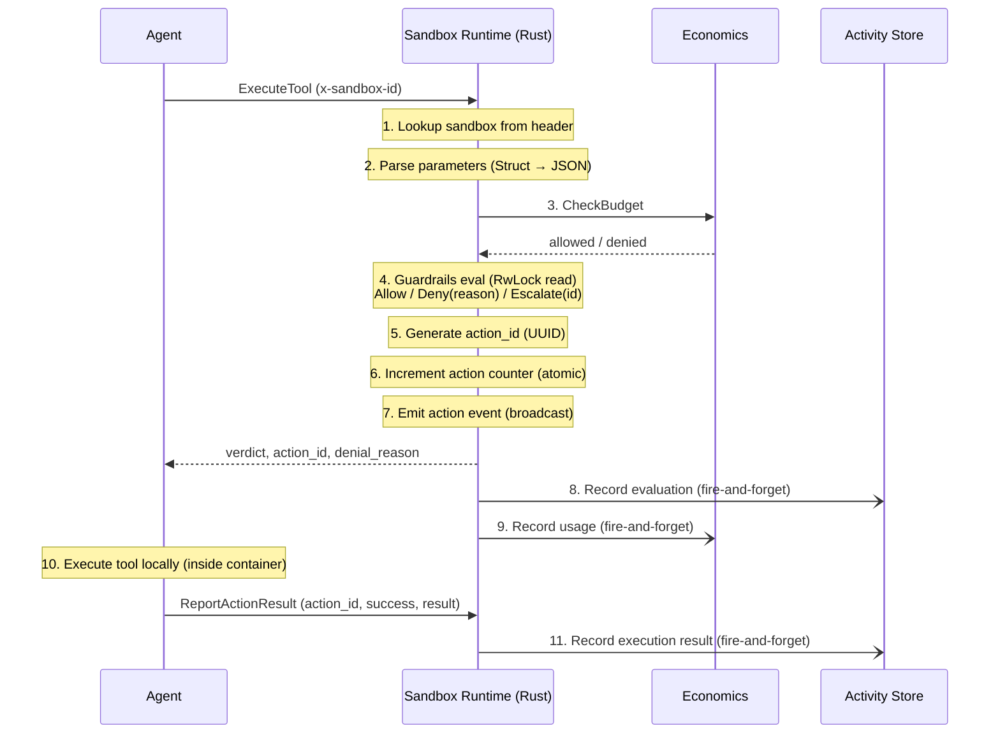
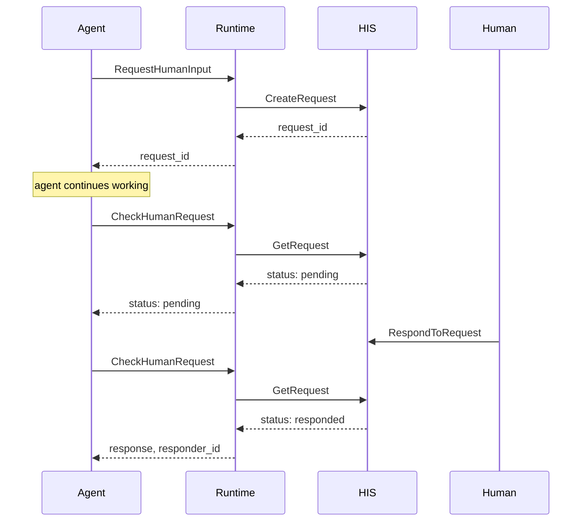
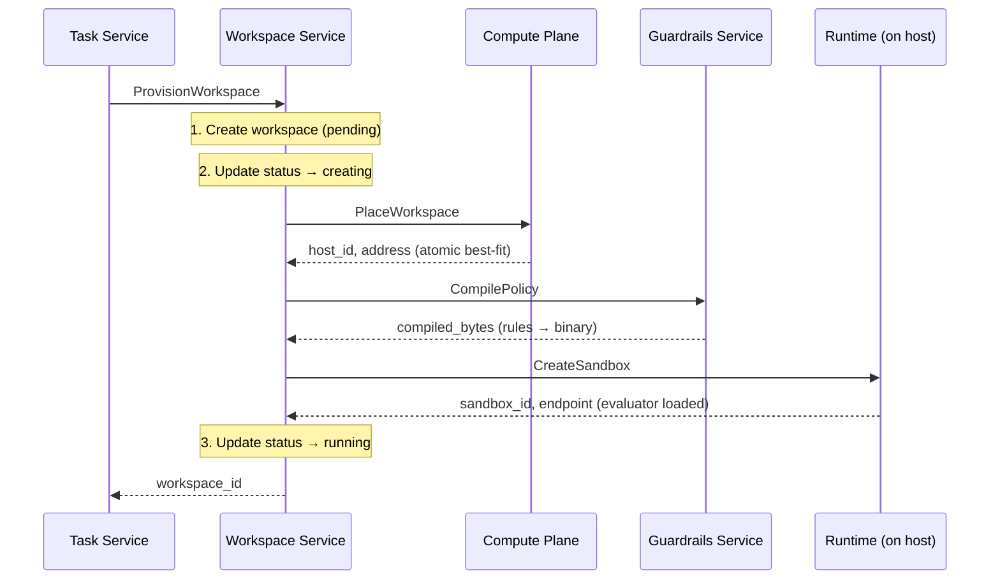
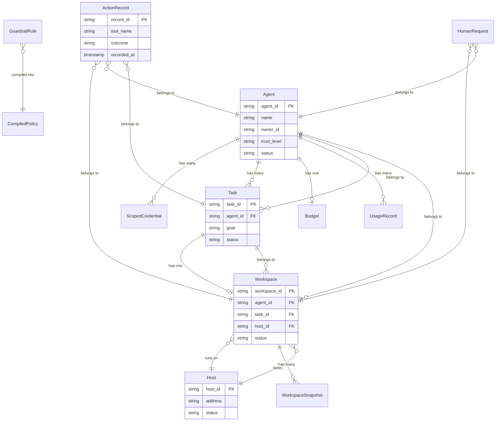

# Architecture

Bulkhead follows a control-plane / data-plane architecture. The **control plane** (Go) manages the lifecycle of agents, workspaces, tasks, guardrails, and budgets. The **data plane** (Rust) runs on each host and executes agent workloads inside sandboxed environments with real-time guardrails evaluation.

## Design Principles

1. **Control-plane / data-plane separation** — The control plane handles orchestration, persistence, and policy management. The data plane handles hot-path execution with minimal latency. They communicate over gRPC.

2. **Guardrails in the hot path** — Every tool call is evaluated against compiled policy rules before execution. The Rust evaluator targets <50ms latency with lock-free concurrent reads via `RwLock`.

3. **Human-in-the-loop as a first-class citizen** — Agents can pause for human input at any point. The interaction is non-blocking (submit + poll pattern), so agents can continue other work while waiting.

4. **Append-only audit trail** — Every action (allowed, denied, or escalated) is recorded immutably in the Activity Store with full context: tool name, parameters, verdict, guardrail rule ID, and latency metrics.

5. **Budget enforcement at runtime** — Per-agent budgets are checked before every tool execution. Usage is metered asynchronously after each successful call. Budget exhaustion triggers immediate denial.

6. **Atomic resource management** — Compute placement uses `SELECT ... FOR UPDATE SKIP LOCKED` to atomically reserve resources, preventing double-allocation under concurrent requests.

7. **Graceful degradation** — Optional upstream services (HIS, Activity Store, Economics) degrade gracefully when not configured. The runtime warns and continues rather than failing.

---

## Service Descriptions

### Identity Service

The agent registry and credential authority. Every AI agent in the platform is registered here with a name, owner, trust level (new/established/trusted), and capability list. The service issues scoped, time-limited credentials (max 24h TTL) using 256-bit cryptographically random tokens stored as SHA-256 hashes. Agents can be suspended (temporary) or deactivated (permanent, revokes all credentials atomically).

**Responsibilities:**
- Agent registration with labels, purpose, and capabilities
- Scoped credential minting and revocation
- Trust level management with justification tracking
- Agent suspension and reactivation with status transition validation

### Workspace Service

The orchestrator for sandboxed execution environments. When a workspace is created, the service coordinates with three other services: Compute Plane (to find a host with sufficient resources), Guardrails (to compile a policy from rule IDs), and the Runtime (to create a sandbox on the selected host). The workspace tracks its full lifecycle from pending through running to terminated.

**Responsibilities:**
- Workspace creation with resource specs (memory, CPU, disk, duration)
- Orchestrated provisioning: placement → policy compilation → sandbox creation
- Workspace termination with sandbox teardown
- Snapshot and restore for pause/resume workflows

### Task Service

The top-level entry point for agent work. A task represents a goal assigned to an agent, with associated workspace configuration, guardrail policies, human interaction settings, and budget limits. When a task transitions to "running", the service automatically provisions a workspace through the Workspace Service.

**Responsibilities:**
- Task creation with full configuration (workspace, guardrails, budget, HIS)
- Status transitions with validation (pending → running → completed/failed/cancelled)
- Automatic workspace provisioning on task start
- Automatic workspace termination on task completion/cancellation

**Valid Status Transitions:**

### Compute Plane Service

Manages the fleet of runtime hosts and handles workspace placement. Hosts register with their total resource capacity and report availability via heartbeats. Placement uses a best-fit algorithm — selecting the smallest host that can satisfy the request — with atomic resource reservation to prevent race conditions.

**Responsibilities:**
- Host registration and deregistration
- Heartbeat processing (resource updates, active sandbox counts)
- Best-fit workspace placement with `FOR UPDATE SKIP LOCKED`
- Host status management (ready/draining/offline)

### Guardrails Service

Manages guardrail rules and compiles them into binary policies consumed by the Rust evaluator. Rules define conditions (tool name patterns, parameter checks) and actions (allow, deny, escalate, log) with priority ordering. The `CompilePolicy` RPC produces a JSON-serialized `CompiledPolicy` that the runtime deserializes into its evaluator. `SimulatePolicy` provides dry-run testing.

**Responsibilities:**
- CRUD operations for guardrail rules
- Policy compilation (rule IDs → binary bytes)
- Policy simulation (dry-run against sample tool calls)

**Rule Types:**
| Type | Condition Format | Example |
|------|-----------------|---------|
| `ToolFilter` | Comma-separated tool names | `exec,shell,sudo` |
| `ParameterCheck` | `field=value` | `path=/etc/shadow` |
| `RateLimit` | Reserved for future use | — |
| `BudgetLimit` | Reserved for future use | — |

### Human Interaction Service (HIS)

Delivers agent requests to humans and collects responses. Supports three request types: approvals, questions, and escalations, each with urgency levels (low/normal/high/critical). Includes configurable delivery channels (Slack, email, Teams) and timeout policies that define what happens when a request expires (escalate, continue, or halt).

**Responsibilities:**
- Create/get/respond to human requests
- Delivery channel configuration per user
- Timeout policy management (global, per-agent, per-workspace)
- Background timeout enforcement worker (30s polling interval)

### Activity Store

An append-only record of every action executed in the platform. Each record captures the full context: workspace, agent, tool name, parameters, result, verdict, guardrail rule ID, denial reason, and latency metrics. Supports both query-based retrieval and real-time streaming via server-sent events.

**Responsibilities:**
- Append-only action recording (no updates or deletes)
- Query with filters (workspace, agent, task, tool, outcome, time range)
- Real-time action streaming with workspace/agent filtering

### Economics Service

Handles usage metering and budget enforcement. Every tool execution is recorded as a usage event with resource type, quantity, and cost. Per-agent budgets define spending limits over 30-day periods. The `CheckBudget` RPC is called in the runtime hot path before every tool execution.

**Responsibilities:**
- Usage recording (resource type, quantity, cost)
- Budget management (set/get per agent, 30-day periods)
- Budget checking (allowed/denied with remaining balance)
- Cost reporting (aggregated by resource type)

### Data Governance Service

A stateless service for content classification and data loss prevention. Classifies content into four levels (Public, Internal, Confidential, Restricted) by detecting patterns like SSNs, credit card numbers, AWS keys, emails, and phone numbers. The `InspectEgress` RPC combines classification with policy checking in a single call for the hot path.

**Responsibilities:**
- Content classification with pattern detection
- Egress policy enforcement (restrict sensitive data to approved destinations)
- Combined classify+check for hot-path use

**Classification Levels:**
| Level | Triggers | Example Patterns |
|-------|----------|-----------------|
| Public | Default (no sensitive patterns) | — |
| Internal | Email, phone patterns | `user@example.com` |
| Confidential | Cloud credentials | `AKIA...` (AWS keys) |
| Restricted | PII patterns | SSN (`123-45-6789`), credit card numbers |

### Sandbox Runtime (Data Plane)

A Rust binary that runs on each host in the fleet, **outside** the agent containers. It exposes two gRPC services: **RuntimeService** (called by the control plane to manage sandboxes) and **AgentAPIService** (called by agents running inside containers for guardrail evaluation). The Runtime is a **policy-only engine** — it evaluates guardrails and budget but does NOT execute tools. Agents run inside Docker containers, execute tools locally, and call back to the Runtime via `ReportActionResult` to record outcomes for the audit trail.

The Runtime manages the full lifecycle of agent containers (create, resource-limit, destroy) via the bollard crate (enabled via `ENABLE_DOCKER=true`). Each sandbox tracks its own guardrails evaluator, container ID, and allowed tool list. The evaluator uses `RwLock` for concurrent read access with support for hot-reload via `UpdateSandboxGuardrails`.

**Responsibilities:**
- Sandbox lifecycle management (create, destroy, status, events)
- Docker container lifecycle (start, stop, resource limits)
- Per-sandbox egress allowlist enforcement via iptables (FORWARD chain rules)
- Guardrails evaluation in the hot path (RwLock for concurrent reads, <50ms)
- Hot-reload of guardrails policies without sandbox restart
- Policy-only `ExecuteTool` — returns verdict + action_id, no tool execution
- `ReportActionResult` — records agent-reported tool outcomes for audit trail
- Budget checking before tool evaluation (optional, via Economics Service)
- Activity recording (optional, via Activity Store)
- Human interaction forwarding (optional, via HIS)

**Layered Security Model:**

| Layer | Enforces | Mechanism |
|-------|----------|-----------|
| Guardrails | Intent (what agent requests) | Policy eval in Rust (<50ms) |
| Egress allowlist | Network behavior (actual traffic) | iptables FORWARD rules per container |
| Container isolation | Process boundary | Docker namespaces, cgroups |
| Image allowlist | Deployment policy | Organizational image registry |

---

## Core Flows

### Flow 1: Action Evaluation (Policy-Only Hot Path)

This is the most performance-critical flow — executed on every tool call an agent makes. Target latency: <50ms for guardrails evaluation. The Runtime is **policy-only**: it evaluates but does not execute tools.

Steps 8, 9, and 11 are fire-and-forget (`tokio::spawn`) — they don't block the response to the agent. The Python SDK's `@tool` decorator handles steps 10-11 transparently.

### Flow 2: Human Interaction (Non-Blocking)

Agents can request human input without blocking. The pattern is: submit a request, get back a `request_id`, then poll for the response.

### Flow 3: Workspace Orchestration

When a task starts, the Workspace Service coordinates three services to provision a sandboxed environment:

If any step fails, the workspace is marked as `failed` rather than throwing — the caller can inspect the workspace status to understand what went wrong.

---

## Data Model

---

## Technology Stack

| Component | Technology | Purpose |
|-----------|-----------|---------|
| Control Plane | Go 1.24 | 9 microservices with gRPC APIs |
| Data Plane | Rust 1.83 | Per-host policy engine, <50ms evaluation, Docker container lifecycle |
| Python SDK | Python 3.10+ | `@tool` decorator, evaluate → execute → report cycle |
| Container Runtime | bollard (Rust) / Docker | Agent container lifecycle (opt-in via `ENABLE_DOCKER`) |
| Database | PostgreSQL 16 | Shared persistence for all control-plane services |
| RPC Framework | gRPC / Protocol Buffers | Inter-service communication |
| Build (Go) | `go build`, buf (proto) | Standard Go toolchain |
| Build (Rust) | Cargo, tonic-build | Async Rust with Tokio |
| Deployment | Docker Compose | 11-container local stack |
| Auth | SHA-256 token hashing | Scoped credentials via gRPC metadata |
| Logging | zap (Go), tracing (Rust) | Structured logging |
| Testing | `go test`, `cargo test`, TestContainers | Unit + integration |
