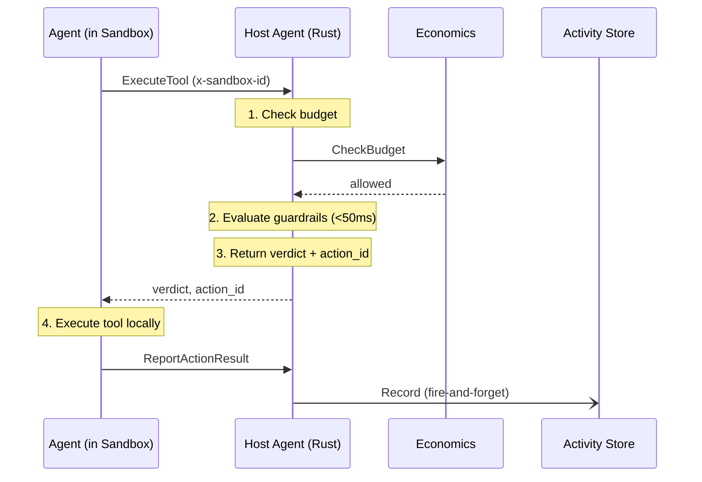

# Agent Developer Guide

This guide shows you how to build AI agents that run inside Bulkhead sandboxes using the Python SDK. Your agent code runs in a Docker container; the Host Agent (a separate Rust process on the host) evaluates guardrails, checks budgets, and records the audit trail.

> **See also:** [Operator Guide](operator-guide.md) | [API Reference](../api-reference.md) | [Architecture](../architecture.md)

---

## How It Works

Your agent runs inside a Docker container (the "sandbox"). When it needs to use a tool, it doesn't call the tool directly — it first asks the Host Agent for permission via gRPC. The Host Agent evaluates guardrails and budget, returns a verdict (ALLOW / DENY / ESCALATE), and the agent only executes the tool if allowed. After execution, the agent reports the result back for the audit trail.



The Python SDK handles this entire cycle transparently through the `@tool` decorator.

---

## Install the SDK

```bash
pip install bulkhead-sdk
```

---

## Define Tools with `@tool`

Use the `@tool` decorator to register tool handlers. Each tool has a name and a description:

```python
from bulkhead import tool

@tool("read_invoice", description="Read a JSON invoice from disk")
def read_invoice(path: str) -> dict:
    with open(path) as f:
        return json.load(f)

@tool("validate_total", description="Validate invoice line items sum to total")
def validate_total(invoice: dict) -> dict:
    line_total = sum(item["amount"] for item in invoice.get("line_items", []))
    expected = invoice.get("total", 0)
    return {
        "valid": abs(line_total - expected) < 0.01,
        "line_total": line_total,
        "expected_total": expected,
    }
```

When the SDK calls these functions, it transparently:
1. Sends `ExecuteTool` to the Host Agent (guardrail + budget check)
2. Executes the function locally only if the verdict is ALLOW
3. Sends `ReportActionResult` back with the outcome

---

## Create an Agent and Execute Tools

```python
from bulkhead import BulkheadAgent, Verdict

with BulkheadAgent(tools=[read_invoice, validate_total]) as agent:
    result = agent.execute_tool("read_invoice", {"path": "/workspace/inv-001.json"})

    if result.verdict == Verdict.ALLOW:
        invoice = result.result
        print(f"Invoice {invoice['id']}: ${invoice['total']}")

    elif result.verdict == Verdict.DENY:
        print(f"Denied: {result.denial_reason}")

    elif result.verdict == Verdict.ESCALATE:
        print(f"Escalated to human review: {result.escalation_id}")
```

### Verdict Handling

| Verdict | Meaning | What to do |
|---------|---------|------------|
| `ALLOW` | Guardrails passed, tool was executed | Use `result.result` |
| `DENY` | Guardrails blocked the call | Check `result.denial_reason`, skip or try alternative |
| `ESCALATE` | Requires human approval | Use `result.escalation_id` to track the pending request |

---

## Human Interaction

Agents can request human input without blocking. Submit a request, get a `request_id`, and poll for the response while continuing other work:

```python
with BulkheadAgent(tools=[...]) as agent:
    # Submit a non-blocking request
    request_id = agent.request_human_input(
        question="Invoice #INV-2024-789 is for $50,000. Approve payment?",
        options=["approve", "reject", "flag for review"],
        context="Vendor: Acme Corp, Amount: $50,000",
        timeout_seconds=300,
    )

    # Continue other work...
    agent.report_progress("Processing other invoices", percent_complete=30)

    # Poll for the response
    response = agent.check_human_request(request_id)
    if response.status == "responded":
        print(f"Human said: {response.response}")
    elif response.status == "expired":
        print("Request timed out")
```

---

## Report Progress

Keep operators informed about what your agent is doing:

```python
with BulkheadAgent(tools=[...]) as agent:
    agent.report_progress("Starting invoice processing", percent_complete=0)
    # ... do work ...
    agent.report_progress("Validating totals", percent_complete=50)
    # ... do work ...
    agent.report_progress("Done", percent_complete=100)
```

Progress events are emitted on the sandbox event channel and visible via `StreamEvents` on the operator side.

---

## Full Example: Invoice Processing Agent

```python
"""Invoice-processing agent using the Bulkhead SDK."""
import json

from bulkhead import BulkheadAgent, Verdict, tool


@tool("read_invoice", description="Read a JSON invoice from disk")
def read_invoice(path: str) -> dict:
    with open(path) as f:
        return json.load(f)


@tool("validate_total", description="Validate invoice line items sum to total")
def validate_total(invoice: dict) -> dict:
    line_total = sum(item["amount"] for item in invoice.get("line_items", []))
    expected = invoice.get("total", 0)
    return {
        "valid": abs(line_total - expected) < 0.01,
        "line_total": line_total,
        "expected_total": expected,
    }


def main():
    with BulkheadAgent(tools=[read_invoice, validate_total]) as agent:
        agent.report_progress("Starting invoice processing", percent_complete=0)

        # Read the invoice — guardrails are evaluated before execution
        result = agent.execute_tool("read_invoice", {"path": "/workspace/inv-001.json"})

        if result.verdict == Verdict.DENY:
            print(f"Denied: {result.denial_reason}")
            return
        if result.verdict == Verdict.ESCALATE:
            print(f"Escalated to human review: {result.escalation_id}")
            return

        invoice = result.result
        print(f"Invoice {invoice.get('id')}: ${invoice.get('total')}")

        # Validate the total
        agent.report_progress("Validating totals", percent_complete=50)
        validation = agent.execute_tool("validate_total", {"invoice": invoice})
        if validation.verdict == Verdict.ALLOW:
            if validation.result["valid"]:
                print("Invoice validated successfully")
            else:
                print(f"Mismatch: line items sum to {validation.result['line_total']}")

        agent.report_progress("Done", percent_complete=100)


if __name__ == "__main__":
    main()
```

---

## Package as a Docker Image

Your agent runs inside a Docker container managed by the Host Agent. Create a `Dockerfile` for your agent:

```dockerfile
FROM python:3.12-slim

WORKDIR /app
COPY requirements.txt .
RUN pip install --no-cache-dir -r requirements.txt

COPY . .

CMD ["python", "agent.py"]
```

With `requirements.txt`:

```
bulkhead-sdk
```

Build and push to your registry:

```bash
docker build -t myregistry/invoice-agent:latest .
docker push myregistry/invoice-agent:latest
```

Then reference the image in your workspace config when creating a task (see [Operator Guide](operator-guide.md#5-create-a-task-full-orchestration)).

---

## Environment Variables

These environment variables are automatically injected into your container by the Host Agent:

| Variable | Description |
|----------|-------------|
| `BULKHEAD_ENDPOINT` | gRPC endpoint of the Host Agent (e.g., `host-agent:50052`) |
| `BULKHEAD_SANDBOX_ID` | Your sandbox's unique identifier |

The SDK reads these automatically — you don't need to configure them manually. Any additional environment variables specified in the workspace config are also injected.

---

## Next Steps

- [LangChain Integration Guide](langchain-guide.md) — use Bulkhead guardrails with LangChain agents
- [Operator Guide](operator-guide.md) — set up the platform, create tasks, monitor agents
- [API Reference](../api-reference.md) — complete RPC reference for all services
