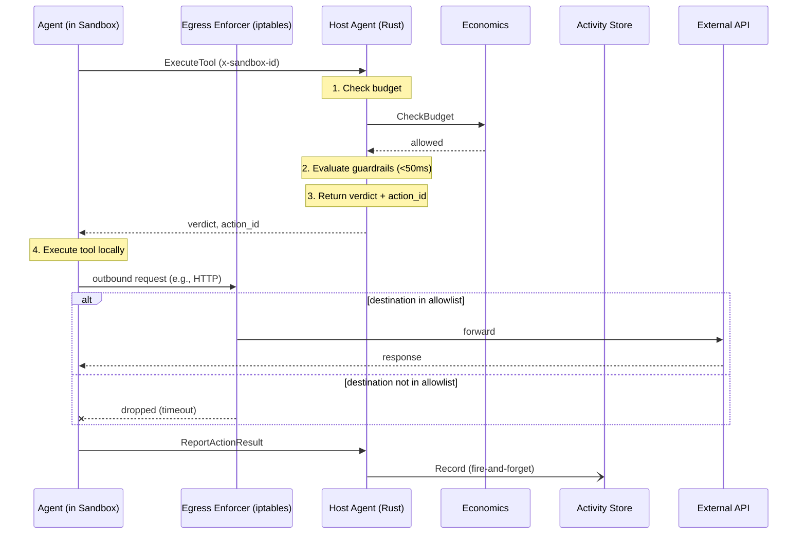

# Agent Developer Guide

This guide shows you how to build AI agents that run inside Bulkhead sandboxes using the Python SDK. Your agent code runs in a Docker container with a configurable isolation tier (standard, hardened, or isolated); the Host Agent (a separate Rust process on the host) evaluates guardrails, checks budgets, and records the audit trail.

> **See also:** [Operator Guide](operator-guide.md) | [API Reference](../api-reference.md) | [Architecture](../architecture.md)

---

## How It Works

Your agent runs inside a Docker container (the "sandbox") with a security profile determined by the isolation tier. When it needs to use a tool, it first asks the Host Agent for permission via gRPC. The Host Agent evaluates guardrails and budget, returns a verdict (ALLOW / DENY / ESCALATE), and the agent only executes the tool if allowed. After execution, the agent reports the result back for the audit trail. Any outbound network calls the tool makes are filtered through the egress enforcer — only allowlisted destinations pass.



The Python SDK handles the evaluate-execute-report cycle transparently through the `@tool` decorator. The egress enforcer operates at the kernel level (iptables) — your code just makes normal network calls and they either succeed or timeout based on the allowlist.

---

## Install the SDK

```bash
pip install bulkhead-sdk
```

---

## Define Tools with `@tool`

Use the `@tool` decorator to register tool handlers. Each tool has a name and a description:

```python
from bulkhead import tool

@tool("read_invoice", description="Read a JSON invoice from disk")
def read_invoice(path: str) -> dict:
    with open(path) as f:
        return json.load(f)

@tool("validate_total", description="Validate invoice line items sum to total")
def validate_total(invoice: dict) -> dict:
    line_total = sum(item["amount"] for item in invoice.get("line_items", []))
    expected = invoice.get("total", 0)
    return {
        "valid": abs(line_total - expected) < 0.01,
        "line_total": line_total,
        "expected_total": expected,
    }
```

When the SDK calls these functions, it transparently:
1. Sends `ExecuteTool` to the Host Agent (guardrail + budget check)
2. Executes the function locally only if the verdict is ALLOW
3. Sends `ReportActionResult` back with the outcome

---

## Create an Agent and Execute Tools

```python
from bulkhead import BulkheadAgent, Verdict

with BulkheadAgent(tools=[read_invoice, validate_total]) as agent:
    result = agent.execute_tool("read_invoice", {"path": "/workspace/inv-001.json"})

    if result.verdict == Verdict.ALLOW:
        invoice = result.result
        print(f"Invoice {invoice['id']}: ${invoice['total']}")

    elif result.verdict == Verdict.DENY:
        print(f"Denied: {result.denial_reason}")

    elif result.verdict == Verdict.ESCALATE:
        print(f"Escalated to human review: {result.escalation_id}")
```

### Verdict Handling

| Verdict | Meaning | What to do |
|---------|---------|------------|
| `ALLOW` | Guardrails passed, tool was executed | Use `result.result` |
| `DENY` | Guardrails blocked the call | Check `result.denial_reason`, skip or try alternative |
| `ESCALATE` | Requires human approval | Use `result.escalation_id` to track the pending request |

---

## Human Interaction

Agents can request human input without blocking. Submit a request, get a `request_id`, and poll for the response while continuing other work:

```python
with BulkheadAgent(tools=[...]) as agent:
    # Submit a non-blocking request
    request_id = agent.request_human_input(
        question="Invoice #INV-2024-789 is for $50,000. Approve payment?",
        options=["approve", "reject", "flag for review"],
        context="Vendor: Acme Corp, Amount: $50,000",
        timeout_seconds=300,
    )

    # Continue other work...
    agent.report_progress("Processing other invoices", percent_complete=30)

    # Poll for the response
    response = agent.check_human_request(request_id)
    if response.status == "responded":
        print(f"Human said: {response.response}")
    elif response.status == "expired":
        print("Request timed out")
```

---

## Report Progress

Keep operators informed about what your agent is doing:

```python
with BulkheadAgent(tools=[...]) as agent:
    agent.report_progress("Starting invoice processing", percent_complete=0)
    # ... do work ...
    agent.report_progress("Validating totals", percent_complete=50)
    # ... do work ...
    agent.report_progress("Done", percent_complete=100)
```

Progress events are emitted on the sandbox event channel and visible via `StreamEvents` on the operator side.

---

## Full Example: Invoice Processing Agent

```python
"""Invoice-processing agent using the Bulkhead SDK."""
import json

from bulkhead import BulkheadAgent, Verdict, tool


@tool("read_invoice", description="Read a JSON invoice from disk")
def read_invoice(path: str) -> dict:
    with open(path) as f:
        return json.load(f)


@tool("validate_total", description="Validate invoice line items sum to total")
def validate_total(invoice: dict) -> dict:
    line_total = sum(item["amount"] for item in invoice.get("line_items", []))
    expected = invoice.get("total", 0)
    return {
        "valid": abs(line_total - expected) < 0.01,
        "line_total": line_total,
        "expected_total": expected,
    }


def main():
    with BulkheadAgent(tools=[read_invoice, validate_total]) as agent:
        agent.report_progress("Starting invoice processing", percent_complete=0)

        # Read the invoice — guardrails are evaluated before execution
        result = agent.execute_tool("read_invoice", {"path": "/workspace/inv-001.json"})

        if result.verdict == Verdict.DENY:
            print(f"Denied: {result.denial_reason}")
            return
        if result.verdict == Verdict.ESCALATE:
            print(f"Escalated to human review: {result.escalation_id}")
            return

        invoice = result.result
        print(f"Invoice {invoice.get('id')}: ${invoice.get('total')}")

        # Validate the total
        agent.report_progress("Validating totals", percent_complete=50)
        validation = agent.execute_tool("validate_total", {"invoice": invoice})
        if validation.verdict == Verdict.ALLOW:
            if validation.result["valid"]:
                print("Invoice validated successfully")
            else:
                print(f"Mismatch: line items sum to {validation.result['line_total']}")

        agent.report_progress("Done", percent_complete=100)


if __name__ == "__main__":
    main()
```

---

## Package as a Docker Image

Your agent runs inside a Docker container managed by the Host Agent. Create a `Dockerfile` for your agent:

```dockerfile
FROM python:3.12-slim

WORKDIR /app
COPY requirements.txt .
RUN pip install --no-cache-dir -r requirements.txt

COPY . .

CMD ["python", "agent.py"]
```

With `requirements.txt`:

```
bulkhead-sdk
```

Build and push to your registry:

```bash
docker build -t myregistry/invoice-agent:latest .
docker push myregistry/invoice-agent:latest
```

Then reference the image in your workspace config when creating a task (see [Operator Guide](operator-guide.md#5-create-a-task-full-orchestration)).

---

## Environment Variables

These environment variables are automatically injected into your container during workspace provisioning:

| Variable | Description |
|----------|-------------|
| `BULKHEAD_ENDPOINT` | gRPC endpoint of the Host Agent (e.g., `host-agent:50052`) |
| `BULKHEAD_SANDBOX_ID` | Your sandbox's unique identifier |
| `BULKHEAD_AGENT_TOKEN` | Scoped credential for authenticated API calls (auto-minted at provisioning) |
| `BULKHEAD_AGENT_ID` | Your agent's unique identifier |

The SDK reads these automatically — you don't need to configure them manually. The `BULKHEAD_AGENT_TOKEN` is a time-limited credential scoped to your agent's allowed tools, minted automatically during workspace provisioning. It expires when the workspace's max duration elapses. Any additional environment variables specified in the workspace config are also injected.

---

## Data Loss Prevention (DLP)

When your agent calls `ExecuteTool` with a tool that includes a `destination`, `url`, or `endpoint` parameter, the Host Agent automatically inspects the outbound content for sensitive data patterns (SSNs, credit card numbers, AWS keys, etc.) before returning the verdict.

If the content contains sensitive data targeting a non-approved destination, the verdict will be `DENY` with a reason like `"DLP denied: restricted data cannot be sent to external destination"`. This happens transparently — your code simply sees a `DENY` verdict and should handle it like any other guardrail denial.

**What gets inspected:**
- Parameters named `destination`, `url`, or `endpoint` are treated as the target
- Parameters named `content`, `body`, or `data` are scanned for sensitive patterns
- Sensitive patterns include: SSNs, credit card numbers, AWS keys, email addresses, phone numbers

DLP inspection is a best-effort check — if the Governance Service is unavailable, the tool call proceeds normally.

---

## Network Egress

Your container's outbound network access is restricted by an **egress allowlist** — a set of approved destination hosts and CIDRs configured by the operator when the task is created. This is enforced at the kernel level via iptables, not by the SDK.

### What's always allowed

- **DNS** (port 53) — your code can resolve hostnames normally
- **Host Agent callback** — the SDK's gRPC connection to the Host Agent always works

### What happens when you hit a non-allowed destination

Outbound connections to destinations not in the allowlist are **silently dropped**. Your code sees a connection timeout or "network unreachable" error — there is no SDK-level exception or audit trail entry. Handle this gracefully:

```python
@tool("fetch_api", description="Call external API")
def fetch_api(url: str) -> dict:
    import requests
    try:
        response = requests.get(url, timeout=10)
        return response.json()
    except requests.exceptions.ConnectionError:
        return {"error": "Connection failed — destination may not be in the egress allowlist"}
```

### How to communicate egress requirements

You don't configure egress directly — the operator sets `egress_allowlist` in the workspace config when creating a task. Document which external hosts your agent needs so operators know what to allowlist:

```yaml
# Example: this agent needs access to
# - api.stripe.com (payment processing)
# - db.internal.example.com (invoice database)
# - 10.0.0.0/8 (internal network)
```

The operator then includes these in `egress_allowlist` when creating the task (see [Operator Guide](operator-guide.md#5-create-a-task-full-orchestration)).

### Layered security

Egress enforcement is one layer of the sandbox security model:

| Layer | What it controls | How |
|-------|-----------------|-----|
| **Guardrails** | What the agent *intends* to do (tool calls) | Scoped policy evaluation (<50ms) |
| **DLP** | What *data* leaves the sandbox | Content inspection via Governance Service |
| **Egress allowlist** | Where the agent can *actually* connect | iptables FORWARD rules per container |
| **Container isolation** | Process boundary and resource limits | Tiered: standard (cgroups), hardened (seccomp + caps), isolated (gVisor/Kata) |

Guardrails evaluate intent; DLP inspects content; egress enforces network behavior. A tool call can be ALLOWED by guardrails but blocked by DLP (sensitive data) or egress (non-allowlisted destination).

---

## Next Steps

- [LangChain Integration Guide](langchain-guide.md) — use Bulkhead guardrails with LangChain agents
- [Operator Guide](operator-guide.md) — set up the platform, create tasks, monitor agents
- [API Reference](../api-reference.md) — complete RPC reference for all services
