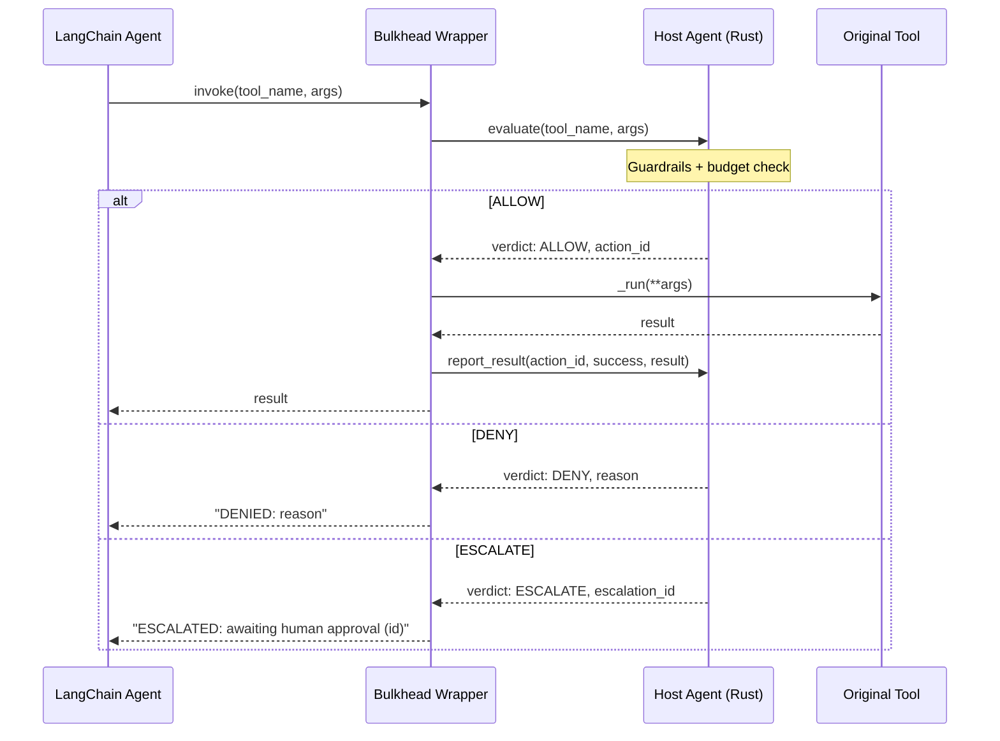

# LangChain Integration Guide

You already have a LangChain agent. Bulkhead adds guardrails, budget enforcement, egress control, and a complete audit trail — without rewriting your tools.

> **See also:** [Agent Developer Guide](agent-guide.md) | [API Reference](../api-reference.md)

---

## Install

```bash
pip install bulkhead-sdk langchain-core
```

---

## Wrap Your Tools

Take your existing LangChain tools and wrap them with `wrap_langchain_tools`. Every tool call now goes through Bulkhead's guardrail evaluation before execution:

```python
from langchain_core.tools import tool

# Your existing LangChain tools — no changes needed
@tool
def search_docs(query: str) -> str:
    """Search internal documents."""
    return f"Results for {query}"

@tool
def send_email(to: str, subject: str, body: str) -> str:
    """Send an email."""
    return f"Sent to {to}"

# Wrap them with Bulkhead guardrails
from bulkhead import BulkheadAgent
from bulkhead.langchain import wrap_langchain_tools

with BulkheadAgent() as agent:
    guarded_tools = wrap_langchain_tools(agent, [search_docs, send_email])

    # Use guarded_tools in your LangChain agent as normal
    # agent_executor = create_react_agent(llm, guarded_tools)
    # agent_executor.invoke({"input": "Find Q4 revenue docs"})
```

That's it. `wrap_langchain_tools` preserves each tool's name, description, and parameter schema — your LLM's function-calling behavior is unchanged.

---

## How It Works

When a wrapped tool is invoked, the wrapper runs the evaluate → execute → report cycle:



The wrapper calls two methods on `BulkheadAgent`:

1. **`evaluate(name, params)`** — Calls the Host Agent's `ExecuteTool` RPC to check guardrails and budget. Returns a verdict without executing anything.
2. **`report_result(action_id, success, result)`** — Records the tool execution outcome for the audit trail.

---

## What the Agent Sees

When a tool is denied or escalated, the LangChain agent receives a string response it can reason about:

| Bulkhead Verdict | LangChain Tool Output | Agent Behavior |
|------------------|-----------------------|----------------|
| `ALLOW` | The tool's actual return value | Normal |
| `DENY` | `"DENIED: <reason>"` | Agent sees the denial and can try an alternative |
| `ESCALATE` | `"ESCALATED: awaiting human approval (<id>)"` | Agent sees the escalation and can wait or continue other work |

---

## Full Example

```python
"""Bring an existing LangChain agent to Bulkhead."""
from __future__ import annotations

from langchain_core.tools import tool

from bulkhead import BulkheadAgent
from bulkhead.langchain import wrap_langchain_tools


# Standard LangChain tools — no Bulkhead decorator needed
@tool
def search_docs(query: str, max_results: int = 5) -> dict:
    """Search internal documents."""
    return {"results": [f"doc about {query}"], "count": 1}


@tool
def send_email(to: str, subject: str, body: str) -> dict:
    """Send an email."""
    return {"sent": True, "to": to}


def main():
    with BulkheadAgent() as agent:
        # Wrap tools with guardrail enforcement
        guarded_tools = wrap_langchain_tools(agent, [search_docs, send_email])

        # Use them directly
        result = guarded_tools[0].invoke({"query": "Q4 revenue", "max_results": 3})
        print(f"Search result: {result}")

        result = guarded_tools[1].invoke({
            "to": "finance@example.com",
            "subject": "Q4 Report",
            "body": "Please review attached.",
        })
        print(f"Email result: {result}")

        # Or pass to a LangChain agent:
        # from langgraph.prebuilt import create_react_agent
        # agent_executor = create_react_agent(llm, guarded_tools)
        # agent_executor.invoke({"input": "Find and email Q4 revenue docs"})


if __name__ == "__main__":
    main()
```

---

## What You Get

By wrapping your LangChain tools with Bulkhead, every tool call is:

- **Guardrail-evaluated** — compiled policy rules checked in <50ms (ALLOW / DENY / ESCALATE)
- **Budget-checked** — per-agent spending limits enforced before execution
- **Audit-trailed** — every evaluation and execution recorded immutably in the Activity Store
- **Egress-controlled** — your container's outbound network is restricted to an operator-defined allowlist (see [Network Egress](agent-guide.md#network-egress))
- **Human-in-the-loop ready** — ESCALATE verdicts can trigger human approval flows

The guardrail policy, budget, egress allowlist, and container image are all configured by the operator when creating the task — your agent code doesn't need to know about them.

---

## Environment Variables

Inside a Bulkhead sandbox container, these are auto-injected:

| Variable | Description |
|----------|-------------|
| `BULKHEAD_ENDPOINT` | gRPC endpoint of the Host Agent (e.g., `host-agent:50052`) |
| `BULKHEAD_SANDBOX_ID` | Your sandbox's unique identifier |

`BulkheadAgent()` reads these automatically — no manual configuration needed.

---

## Next Steps

- [Agent Developer Guide](agent-guide.md) — build agents from scratch with the Python SDK's `@tool` decorator
- [Operator Guide](operator-guide.md) — deploy the stack and configure guardrails, budgets, and egress
- [API Reference](../api-reference.md) — complete RPC reference
