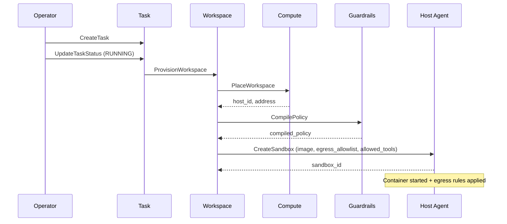

# Operator Guide

This guide walks you through deploying and operating the Bulkhead platform. You'll start the full stack, register an agent, configure guardrails and budgets, create a task with workspace provisioning, and monitor the audit trail.

> **See also:** [Architecture](../architecture.md) | [API Reference](../api-reference.md) | [Deployment Guide](../deployment.md)

---

## Prerequisites

| Tool | Purpose |
|------|---------|
| Docker + Docker Compose v2 | Run the full stack (11 containers) |
| [grpcurl](https://github.com/fullstorydev/grpcurl) | Interact with gRPC APIs from the command line |

---

## 1. Start the Stack

```bash
# Build and start all services (9 Go + 1 Rust + PostgreSQL)
docker compose -f deploy/docker-compose.yml up --build

# Verify all services are healthy
docker compose -f deploy/docker-compose.yml ps
```

All services should show `healthy` status. PostgreSQL starts first, then control-plane services, then the Host Agent.

---

## 2. Register an Agent and Mint Credentials

```bash
# Register a new agent
grpcurl -plaintext -d '{
  "name": "invoice-processor",
  "description": "Processes incoming invoices and routes for approval",
  "owner_id": "org-acme",
  "purpose": "Automate accounts payable workflow",
  "trust_level": "AGENT_TRUST_LEVEL_NEW",
  "capabilities": ["read_file", "write_file", "http_request"]
}' localhost:50060 platform.identity.v1.IdentityService/RegisterAgent

# Mint a scoped credential (1 hour TTL)
grpcurl -plaintext -d '{
  "agent_id": "<agent_id from above>",
  "scopes": ["workspace:create", "tool:execute"],
  "ttl_seconds": 3600
}' localhost:50060 platform.identity.v1.IdentityService/MintCredential
# Response includes a one-time "token" field — save it for authenticated calls
```

---

## 3. Create Guardrail Rules and Compile a Policy

```bash
# Create a rule that denies shell execution
grpcurl -plaintext -d '{
  "name": "deny-shell",
  "description": "Block shell and exec tools",
  "type": "RULE_TYPE_TOOL_FILTER",
  "condition": "exec,shell,sudo",
  "action": "RULE_ACTION_DENY",
  "priority": 1,
  "enabled": true
}' localhost:50062 platform.guardrails.v1.GuardrailsService/CreateRule

# Create a rule that escalates file deletions to humans
grpcurl -plaintext -d '{
  "name": "escalate-delete",
  "description": "Require human approval for file deletion",
  "type": "RULE_TYPE_TOOL_FILTER",
  "condition": "delete_file,rm",
  "action": "RULE_ACTION_ESCALATE",
  "priority": 5,
  "enabled": true
}' localhost:50062 platform.guardrails.v1.GuardrailsService/CreateRule

# Compile both rules into a binary policy
grpcurl -plaintext -d '{
  "rule_ids": ["<rule_id_1>", "<rule_id_2>"]
}' localhost:50062 platform.guardrails.v1.GuardrailsService/CompilePolicy
# Returns compiled_policy (bytes) and rules_count

# Dry-run the policy against a sample tool call
grpcurl -plaintext -d '{
  "rule_ids": ["<rule_id_1>", "<rule_id_2>"],
  "tool_name": "exec",
  "parameters": {},
  "agent_id": "agent-001"
}' localhost:50062 platform.guardrails.v1.GuardrailsService/SimulatePolicy
# Returns verdict: DENY, matched_rule: "deny-shell"
```

---

## 4. Set a Budget

```bash
# Set a $100 budget for the agent
grpcurl -plaintext -d '{
  "agent_id": "<agent_id>",
  "limit": 100.00,
  "currency": "USD"
}' localhost:50066 platform.economics.v1.EconomicsService/SetBudget

# Check if the agent can proceed
grpcurl -plaintext -d '{
  "agent_id": "<agent_id>",
  "estimated_cost": 0.50
}' localhost:50066 platform.economics.v1.EconomicsService/CheckBudget
# Returns: allowed: true, remaining: 100.00
```

---

## 5. Create a Task (Full Orchestration)

Creating a task and transitioning it to `RUNNING` triggers the full orchestration flow:

1. **Compute Placement** — find a host with sufficient resources
2. **Guardrails Compilation** — compile rules into a binary policy
3. **Sandbox Creation** — deploy a Docker container on the host with egress rules applied

```bash
grpcurl -plaintext -d '{
  "agent_id": "<agent_id>",
  "goal": "Process all pending invoices for Q4",
  "workspace_config": {
    "memory_mb": 1024,
    "cpu_millicores": 500,
    "disk_mb": 2048,
    "max_duration_secs": 3600,
    "allowed_tools": ["read_file", "write_file", "http_request"],
    "container_image": "myregistry/invoice-agent:latest",
    "egress_allowlist": ["api.internal.example.com", "10.0.0.0/8"]
  },
  "guardrail_policy_id": "<rule_id_1>,<rule_id_2>",
  "budget_config": {
    "max_cost": 50.00,
    "currency": "USD",
    "on_exceeded": "BUDGET_ON_EXCEEDED_HALT"
  }
}' localhost:50068 platform.task.v1.TaskService/CreateTask

# Transition task to running (triggers workspace provisioning)
grpcurl -plaintext -d '{
  "task_id": "<task_id>",
  "status": "TASK_STATUS_RUNNING"
}' localhost:50068 platform.task.v1.TaskService/UpdateTaskStatus
```

### What happens under the hood



---

## 6. Execute a Tool (Policy-Only Hot Path)

Inside a running sandbox, the agent calls the Agent API with its sandbox ID in metadata. The Host Agent evaluates guardrails but does NOT execute the tool — the agent executes locally and reports the result.

```bash
# Evaluate a tool call
grpcurl -plaintext \
  -H "x-sandbox-id: <sandbox_id>" \
  -d '{
    "tool_name": "read_file",
    "parameters": {"path": "/data/invoices/inv-001.json"},
    "justification": "Reading invoice for processing"
  }' localhost:50052 platform.host_agent.v1.HostAgentAPIService/ExecuteTool
# Returns: verdict (ALLOW/DENY/ESCALATE), action_id

# After executing the tool locally, report the result
grpcurl -plaintext \
  -H "x-sandbox-id: <sandbox_id>" \
  -d '{
    "action_id": "<action_id from above>",
    "success": true,
    "result": {"content": "...invoice data..."}
  }' localhost:50052 platform.host_agent.v1.HostAgentAPIService/ReportActionResult
```

---

## 7. Human-in-the-Loop Escalation

```bash
# Agent requests human input (non-blocking)
grpcurl -plaintext \
  -H "x-sandbox-id: <sandbox_id>" \
  -d '{
    "question": "Invoice #INV-2024-789 is for $50,000. Approve payment?",
    "options": ["approve", "reject", "flag for review"],
    "context": "Vendor: Acme Corp, Amount: $50,000, Due: 2024-03-15",
    "timeout_seconds": 300
  }' localhost:50052 platform.host_agent.v1.HostAgentAPIService/RequestHumanInput
# Returns: request_id (agent can continue working)

# Agent polls for response
grpcurl -plaintext -d '{
  "request_id": "<request_id>"
}' localhost:50052 platform.host_agent.v1.HostAgentAPIService/CheckHumanRequest
# Returns: status (pending/responded/expired), response, responder_id

# Human responds (via operator API)
grpcurl -plaintext -d '{
  "request_id": "<request_id>",
  "response": "approve",
  "responder_id": "user-jane"
}' localhost:50063 platform.human.v1.HumanInteractionService/RespondToRequest
```

---

## 8. Monitor: Query the Audit Trail

```bash
# Query all actions for a workspace
grpcurl -plaintext -d '{
  "workspace_id": "<workspace_id>"
}' localhost:50065 platform.activity.v1.ActivityStoreService/QueryActions

# Stream real-time actions (server-streaming)
grpcurl -plaintext -d '{
  "workspace_id": "<workspace_id>"
}' localhost:50065 platform.activity.v1.ActivityStoreService/StreamActions

# Get sandbox status
grpcurl -plaintext -d '{
  "sandbox_id": "<sandbox_id>"
}' localhost:50052 platform.host_agent.v1.HostAgentService/GetSandboxStatus
```

---

## 9. Tear Down

```bash
# Cancel the task (terminates workspace + sandbox)
grpcurl -plaintext -d '{
  "task_id": "<task_id>"
}' localhost:50068 platform.task.v1.TaskService/CancelTask

# Stop the stack
docker compose -f deploy/docker-compose.yml down
```

---

## Next Steps

- [Agent Developer Guide](agent-guide.md) — build agents with the Python SDK
- [LangChain Integration Guide](langchain-guide.md) — wrap Bulkhead guardrails into LangChain tools
- [API Reference](../api-reference.md) — complete RPC reference for all services
- [Architecture](../architecture.md) — design principles, service details, core flow diagrams
- [Deployment Guide](../deployment.md) — Docker Compose topology, configuration, database schema
